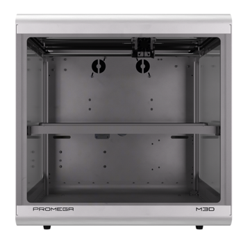
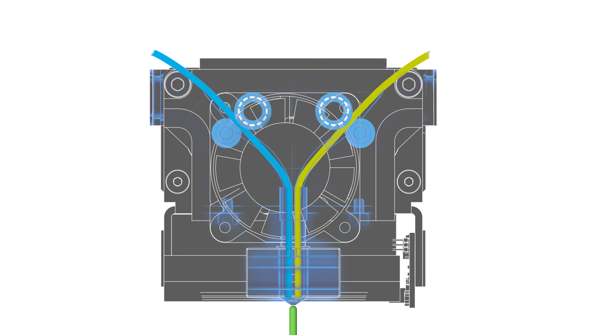
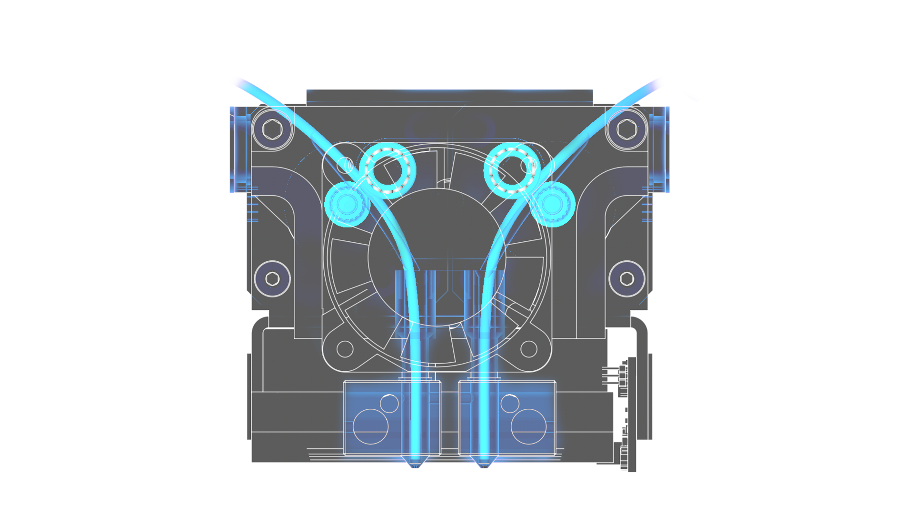
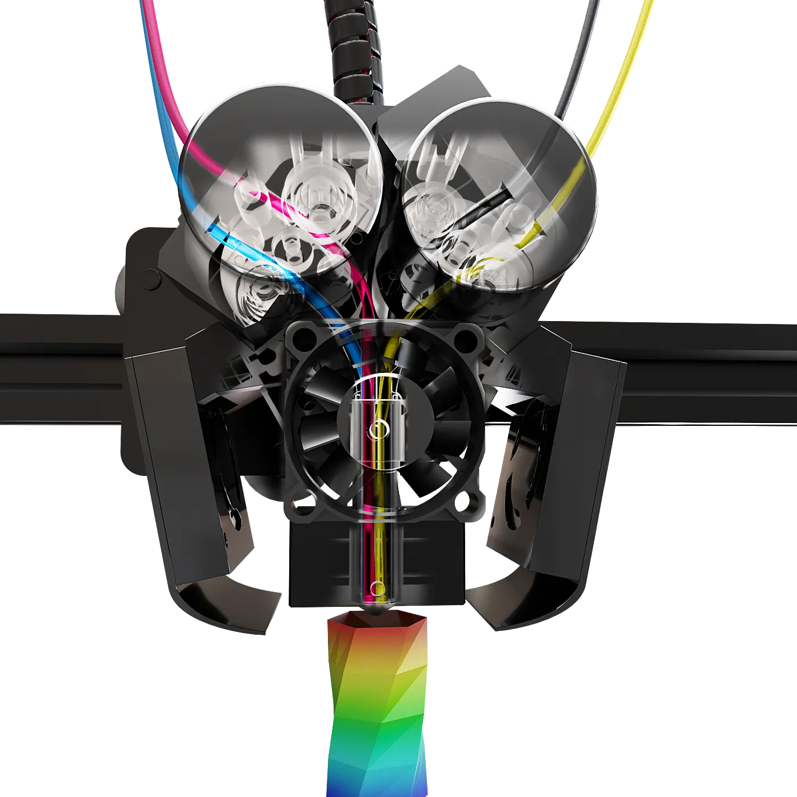

# Welcome!

Welcome to the  M3D Promega's User Manual.

## Features

### Expandable

The Promega is expandable, meaning you can customize it to suit your needs. These are 4 possible extruder configurations.



The Compound nozzle is a dual mixing nozzle, which takes in two filaments and either prints one at a time or mixes them together. 

A standard Promega will come with this extruder.




  
The K'Tana hot end is two, independent nozzles for dual printing. 

K'Tana nozzles are seamless, long nozzles that include a thin-wall heat break to reduce energy consumption and eliminate leaks.




  
The Quad extruder takes in four filaments and can either print one at a time or mix for blended colors.

You can create beautiful color prints using our CMYK color-calibrated mixing filament.




Our high-temp extruder add-on allows you to extrude materials up to 350 C. 

This upgrade is ideal for printing high-temp materials such as PEEK, if you are producing small prints. 

For larger prints, you may need a more robust system upgrade. If you are interested in this, please fill out this [form](https://airtable.com/shrPYVe4EY4mXUM4e).



Feel free to browse the [part store](https://store.printm3d.com/collections/parts) for more.

### 20" All Metal Frame

Fully enclosed in a 20" all-metal frame.

### 15.3" Cubic Build Volume

15.3"-cubed build volume makes printing just about anything possible.

### Open Source

Both the [Duet3D electronics](https://www.duet3d.com/) and the [Promega parts](documentation/) are open-sourced.

## Where To Start

Please start with the [Beginner Guides](beginners-setup-guides/).

If the Beginner Guides aren't enough, try our [Advanced Guides](advanced-setup-guides/). 

## **Other Resources**

### Duet3D Board

#### [Firmware/Software](https://github.com/PrintM3D?tab=repositories)

#### [Duet Maestro](https://duet3d.dozuki.com/c/Duet_2_Maestro)

#### [Duet GCodes](https://duet3d.dozuki.com/Wiki/GCode)

### Promega Parts Store

#### [Linked Here!](https://store.printm3d.com/collections/parts/printer-model_m3d-promega)

### Open Source 

#### [Public Google Drive](https://drive.google.com/open?id=1cmnAcQU7NjgBqAub60Pz7tJyY-e5qH1w)


Houses all iterations of:

* SD Cards
* Slicer
* Printed Part. 


### **Q&A Promega Users**

[Submit Issue](https://github.com/PrintM3D/Promega/issues). Allows you to search for existing issues to upvote them. 

Submit a new issue if you do not find one.

### Contributing

Please feel free to add suggestions to any of the guides by creating a pull-request or issue on [GitHub](https://github.com/PrintM3D/Promega-Docs/issues). This manual is hosted in Github.com via Gitbook.com.

The main way to collaborate to the guides is to become a collaborator. But sometimes you simply want to submit a small contribution, without becoming a regular collaborator.

On GitHub, one can use the popular _Pull Request_ feature. To do so, you would clone [https://github.com/PrintM3D/Promega-Docs](https://github.com/PrintM3D/Promega-Docs), make changes on your own copy, and submit back your changes by submitting a _Pull Request_ to M3D. Then we will review the changes accordingly.

#### Let's Get Started!

