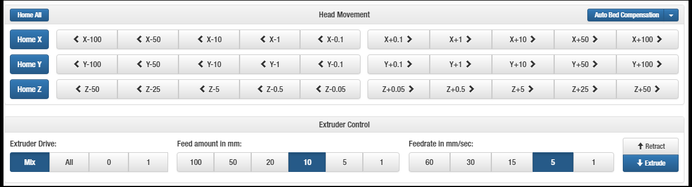
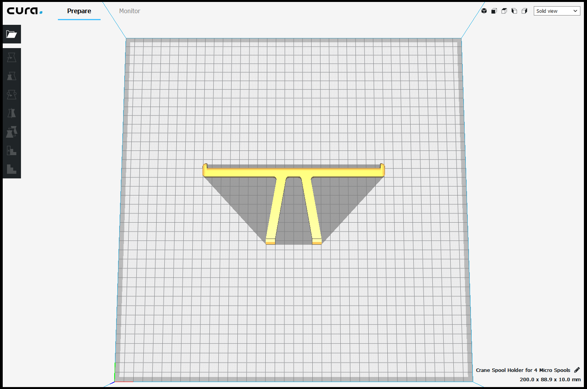
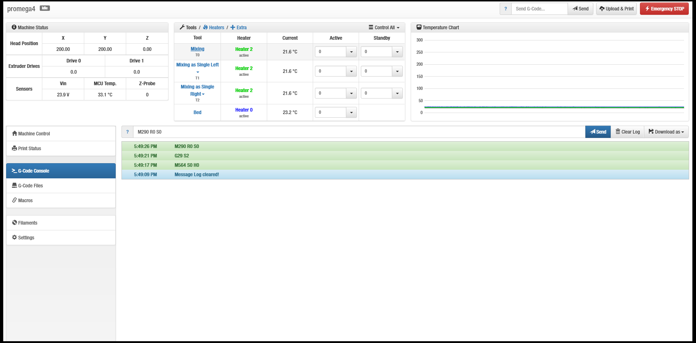
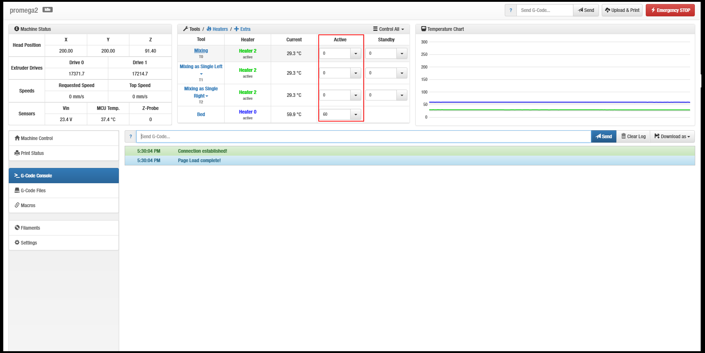
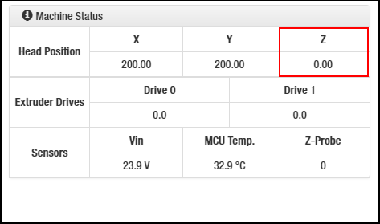
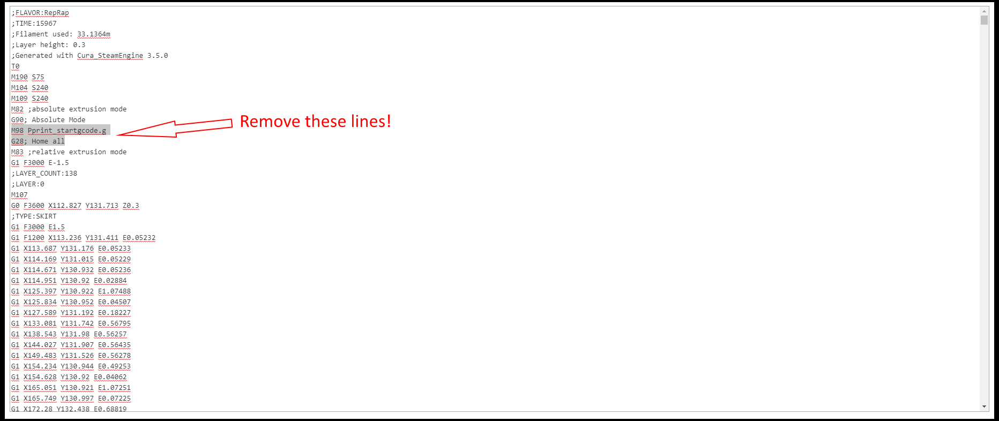

# Bypass Bed Leveling \(Temporary\)

This guide should be used under these certain conditions:


You understand this leveling method is FAST and TEMPORARY. The leveling will be undone after a Z homing, Home All, or power cycle. 



You want to avoid mesh compensation or Z endstop calibration troubleshooting.



Your print is small or medium sized.


#### 

#### Let's get started.

Physically level the bed. Follow the [Mechanical Bed Leveling](../repair-and-maintenance/mechanical-bed-leveling.md) guide.

Home your X and Y only.



Move your extruder to the region you will print on. 



Enter

```text
M564 S0 H0
```

```text
G29 S2
```

```text
M290 R0 S0
```


None of the codes above have any movement involved. 

Make sure they are executed




Heat your bed to desired temperature.



Move the bed until is it paper-width apart from the nozzle. 


Paper-width should have mild resistance when moved around.


Enter

```text
G92 Z0
```


Check your z position value is set to 0.



Start your print.


Make sure your print DOES NOT have 

ANY homing commands \(e.g. G28\)

OR 

ANY reference to `M98 Pprint_startgcode.g`




