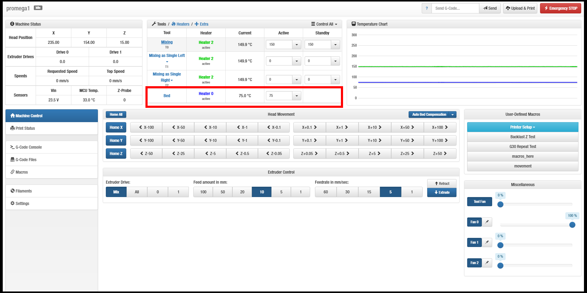
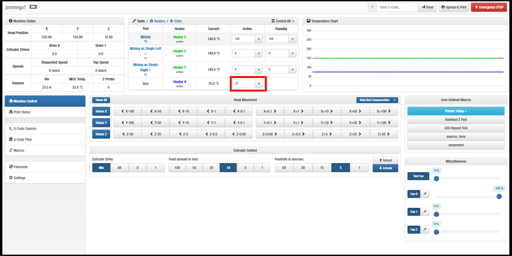
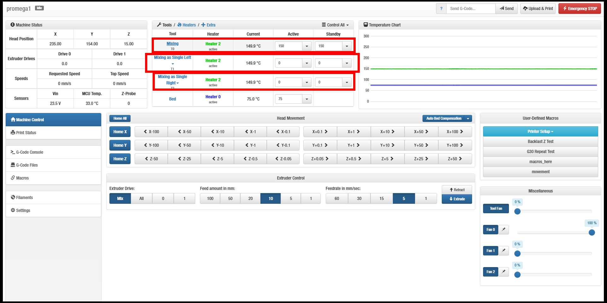
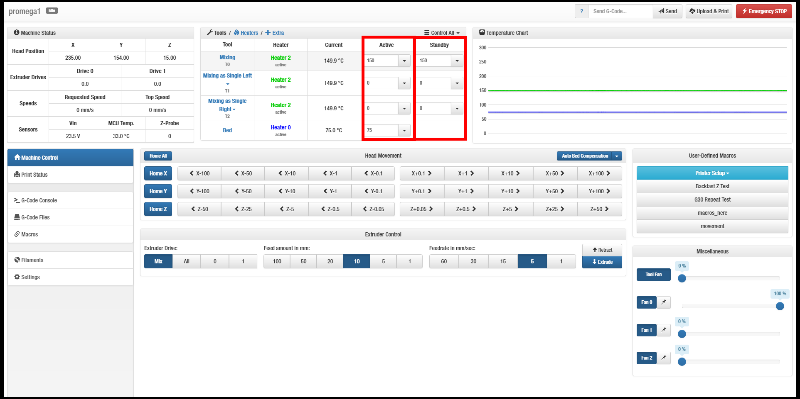
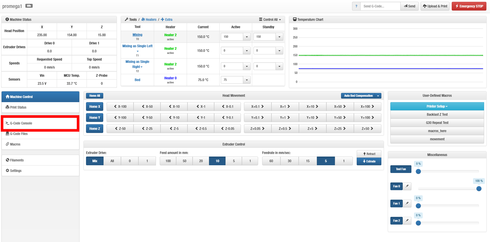

# Heating The Bed & Nozzle

## Heating Modes

### Active

An "Active" heater means:

1. The tool associated with the heater is _**selected and is tool used to print**_. All other tools will display a "standby" message below their heater \(even if its the same heater\).
2. The heater _**can**_ start heating, to given active temperatures.

### Standby

A "Standby" heater means:

1. The tool associated with the heater is _**not selected**_.
2. The heater _**can**_ start heating to given standby temperatures.

### Off

An "Off" heater means:

1. The tool associated with the heater is _**not selected**_.
2. The heater _**cannot**_ start heating.

### Fault

A "Fault" heater means:

1. The tool associated with the heater is _**not selected**_.
2. The heater _**cannot**_ start heating.
3. The heater will not change to a different state, unless the fault is addressed. 
4. See [Heater Troubleshooting](../how-to-troubleshoot/heater.md) page for help.

   \*\*\*\*

## **Heating: The Bed**

### Using The Web Interface

Look the "Bed" row.



The bed only has two states: Active or Off.

Enter desired temperature.



Hit "Enter" key.

### Using G-Code

#### There are two ways to heat the bed: Fast or Slow

1. Definition of _**Slow**_: Set the bed temperature. All future G-code commands _**will not be**_ executed immediately. It will wait until the bed reaches temperature.
2. Definition of _**Fast**_: Set the bed temperature. All future G-code commands _**will be**_ executed immediately.

Navigate to the "G-Code Console" Tab


#### Input Code \(Slow\):

```text
M190 S75; This sets the bed temperature to 75 C
```


#### Input Code \(Fast\):

```text
M140 S75; This sets the bed temperature to 75 C
```

## Heating: The Nozzle

### Using The Web Interface

Look for the desired tool.



Choose a mode: Active or Standby



Enter a number.

Hit "Enter" key.

### Using G-Code

#### There are two ways to heat the extruder: Fast or Slow

1. Definition of _**Slow**_: Set the extruder temperature. All future G-code commands _**will not be**_ executed immediately. It will wait until the bed reaches temperature.
2. Definition of _**Fast**_: Set the extruder temperature. All future G-code commands _**will be**_ executed immediately.

Navigate to the "G-Code Console" Tab



#### Input Code \(Slow\):

```text
M109 S75 T1; This sets the extruder temperature to 75 C. Applies to tool 1.
```


#### Input Code \(Fast\):

```text
G10 T1 R75 S50; This sets the active temperature to 75 C and the standby temperature to 50. Applies to tool 1.
```

