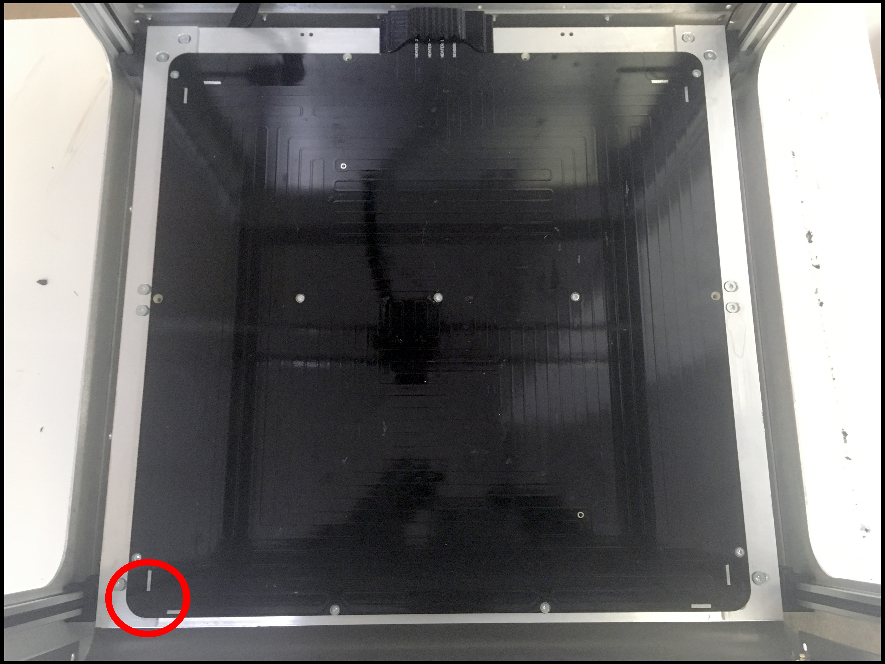
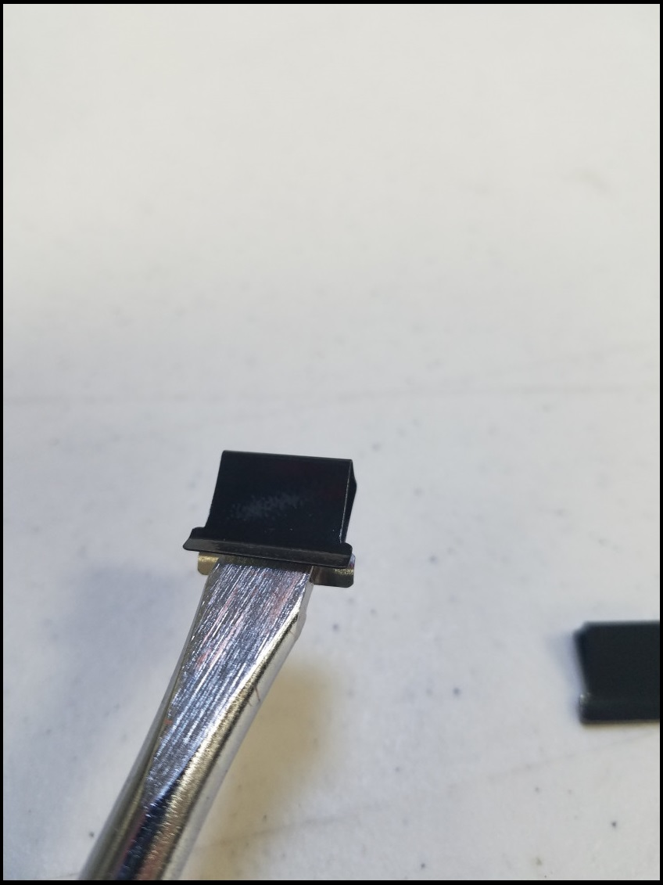

# Get Your Bed Ready

## Setup Your Bed

### Setup 1: Print Bed Sheet

Clean the bare surface \(no oil or dust\)

Remove some of the adhesive cover from the Bed Sheet.


Pick the front left corner.



Stick the corner of the Bed Sheet to the bed.


Line up the edges.


Slowly press the Bed Sheet corner into bed.

Check the edges line up \(again\).

Continue pressing down the rest of the Bed Sheet in a WIPING motion.


Check the edges line up \(again\).

Remove the rest of the adhesive cover.


Finish sticking the rest of the Bed Sheet in a WIPING motion.

### Setup 2: Glass Bed

Pick a position.


Get Glass Bed Clamp

Open Glass Bed Clamp with a flathead screwdriver



Lay & Align glass bed onto the bed.

Clamp bed.


Slide clamp all the way in.


Repeat until all positions are clamped.

## Setup Bed Probe

### Press Home All Button


### Send the extruder toward center

```text
G1 X200 Y200
```

#### Minor G-code Lesson

G1 = Linear Movement

X\#\#\# = X position

Y\#\#\# = Y position

Z\#\#\# =  Z position

### Turn On The Bed

```text
M140 S60
```

#### Minor G-code Lesson

M140 = Set Bed Temperature

S\#\#\# = Bed Temperature \( Celsius\)

### Code Inputs

```text
G31 P999 X-40 y28.5 Z0
G29 S2
M564 S0
```

Wait for bed to reach its temperature.

### Engage Bed Probe


### Move To Position

```text
G1 Z30
```

### Probe

```text
G30
```

### Disengage Bed Probe

### Move Bed To Nozzle

Use these two buttons to move the bed up.


Switch to a smaller step when you get close to the nozzle

### Record Z offset


### More Code Inputs

Replace \#\#\# with the Z offset number from the last step.

The number is POSITIVE ONLY.

```text
G31 P999 X-40 Y28.5 Z###
M564 S1
```

### Move Bed To Position

```text
G1 Z30
```

### Engage Bed Probe \(Again\)

### Probe \(Again\)

```text
G30
```

### Disengage Bed Probe \(Again\)

### Check nozzle height

```text
G1 Z0
```

The bed should be about a paper sheet away from the nozzle.


### Save Into SD card.

Go to the System Editor tab under Settings


Look for "machine\_zprobe.g" \(and click\)


Go to the last line of code.


Replace the Z\#\#\# \(e.g. Z0.95\) with your new Z offset number \(POSITIVE ONLY\).

Save changes. 

Done.

## Map The Bed

### Note:

Assumption: Your bed probe has been setup. 

### Home Printer


### Turn On The Bed

```text
M140 S60
```

### Move Bed To Position

```text
G1 Z30
```

### Engage Bed Probe

### Read The Bed

```text
G29
```

Wait for the probing to finish.

Check for any signs of green. 

* There should be some green.
* If not, your bed probe is NOT setup.


Click close.

### Disengage Bed Probe

You are ready to print.

