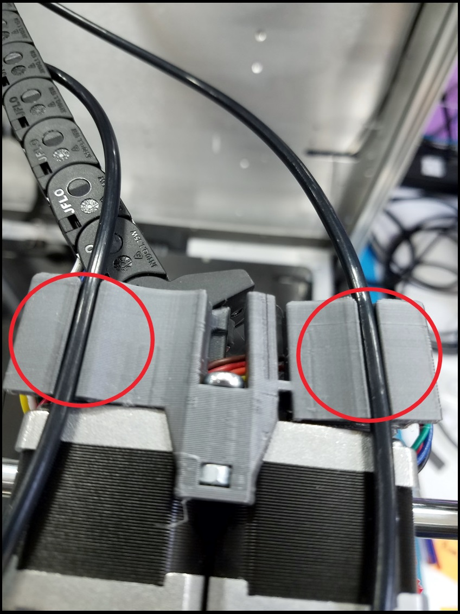
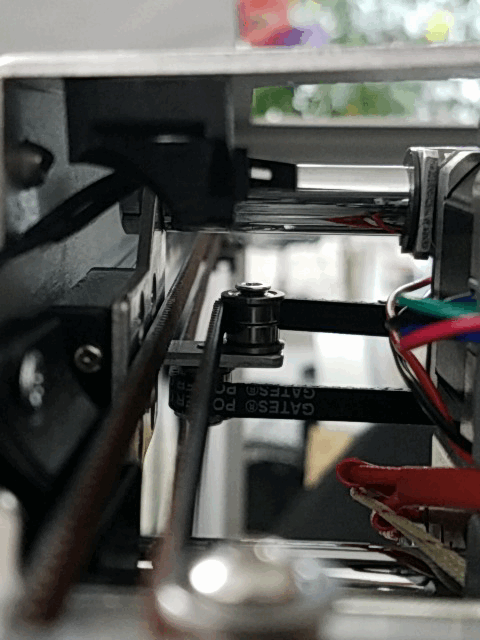
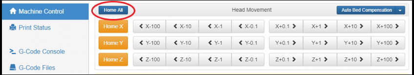
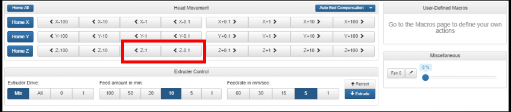

# Homing The Printer

Before you start printing or moving any component of the Promega, we recommend homing the printer. Follow the steps below in order to home your printer. Prior to homing your printer check that the gantry and bed are able to move freely and access the limit switch. This guide assumes you have connected to the Promega as outlined in [Network Setup]().

### Printer Axes


In order to control the Promega it is important to understand the axes of the printer and their orientation. As you can see in the image above the X axis spans across the front of the printer from left to right if you are facing the front of the printer. The Y axis is pointing from the front to the back and the z-axis is pointing down. Remember these axes directions as you jog the printer with the _Machine Control_ tab in the [Duet Web Console](). 


**Positive Z is DOWN**

**Negative Z is UP**


The origin of this coordinate frame is in the top-front-left corner of the printer. This can be seen at the intersection of the three red axes of the 3D printer in the image above.

### The Homing Process

Follow the steps below to correctly home your printer.

#### Checking the path

To ensure that the printer homes correctly, we recommend moving the CoreXY gantry manually to the limit switches located in the back right corner when the motors are not powered. If you need to power down the motors you can use the G-code command `M84` to stop the idle hold of the motors. Watch out as this will disable **all** motors, and could cause the bed to drop. Remove all items from inside of the printer before homing. The PTFE filament tubes on the extruder carriage cable assembly should be clicked in place \(shown in the image below\), or they could cause problems when homing the X-axis.



Move the coreXY gantry against the Y-limit switch, listen for the click of the limit switch. 



Be careful not to move the extruder carriage past the limit switch tab.

It could break off.


Then move the coreXY gantry against the X-limit switch.

Make sure the bed is resting on the Z-limit switch and that there is nothing underneath the bed.

### Homing the Printer


We recommended you tune the Z homing of the printer:

Once after receiving of your Promega.

AND

Any time you make changes to the relative distances of the bed and the nozzle 

* Bed glass installation
* Nozzle replacement
* Extruder swap \(K'Tana vs. Compound\) 

See details on this process at [Tuning the Z Homing Procedure](homing-the-printer.md#tuning-the-z-homing-procedure).




You are now ready to home the printer. There are multiple ways to initiate the homing process. You can press the _Home All_ button located in the _Machine Control_ tab of the Duet Web Console. You can also send the G-code command G28. These two operations will both execute the same file _homeall.g_, located on the microSD card.

The CoreXY gantry should move toward the Y-limit switch located at the back of the printer first. Once it has hit that limit switch, it will move toward the x-limit switch. Next, the bed will lift itself up and back down slowly, until it has hit its limit switch.

Now all axes are homed. Remember that your motors are now powered and you will not be able to move any of the assemblies by hand. Use the `M84` command to temporarily disable idle hold current on your stepper motors, allowing you to move the motors. Your \(0,0,0\) is located at the top-front-left of the printer. 

### Tuning the Z-homing Procedure

**Because the distance between the bed and the nozzle depends on your Promega configuration \(K'tana vs. Compound, Glass vs. no glass\). You will have to tune** _**machine\_zendstop.g**_ **for Z0 to line up.**



Ideally whenever you home the printer and send the command `G1 X0 Y0 Z0` \(telling the printer to go to \(0,0,0\)\) the print bed will touch the nozzle. However, as outlined above, the difference between the bed and the nozzle varies depending on your setup. 

#### Follow the steps below to update your _machine\_zendstop.g_ file.

Home the printer if you have not already done so in the section above.

Send the command

```text
G29 S2
```

This will disable bed leveling. Bed leveling can conflict with your homing value.

Move the printer to Z10 with the command

```text
 G1 Z10
```

Move the printer head to the center with

```text
 G1 X200 Y200
```

Jog the bed up the nozzle with the buttons in machine control until the bed is touching the nozzle. Use the _Z1mm_ and _Z0.1mm_ buttons. Remember that you are about 10mm away from the nozzle.

Once the bed is properly touching the nozzle record the Z-value in _Machine Status_ on the Duet Web Console_._ 


This value will be used in the next step.


Open the _machine\_zendstop.g_ file in the _Settings_ tab of the Duet Web Console. This file is called during the homing process of the Z-axis. Find the `G92` command at the end of the file. This command sets the z-axis height.

Update this value with the following formula:

$$
new value = OldValue - SavedValue
$$



#### For example: 

If the _machine\_zendstop.g_ file currently contains the command

```text
G92 Z376.4
```

and I obtained a value of -0.6. 

My new value would be 377mm: 

$$
377= 376.4 - (-0.6)
$$

I would remove the current command and enter:

```text
G92 Z377
```

Save the file.


#### Next Step

Open the _machine\_axisdimension.g_ file in the _Settings_ tab of the Duet Web Console. This file defines the minimum and maximum dimensions of each axis and will be affected by changes to the z-axis end stop.

Find the second `M208` command at the end of the file.The one that says `Set axis maxima` in the comment.

Change the Z value to be the Z end stop value determined above, rounded up to the next integer. 

#### **For example:**

 If the Z end stop is _**376.4**_, the maximum Z needs to be _**377**_.

If the Z end stop is _**377.2**_, the maximum Z needs to be _**378.**_

If the Z end stop is _**379.0**_, the maximum Z needs to be _**379**_ \(no rounding\).


**Save the file and home the printer again.** 


Although you should now be able to enter the command `G1 Z0`, I don't recommend it. 


**Manually jog your bed to the nozzle again to ensure that Z0 is when the bed is touching the nozzle.**


Continue on to the next phase: [Get Your Bed Ready](get-your-bed-ready.md).

