# Your Extruder

## Know Your Extruder

### Setup 1: Mixing Compound

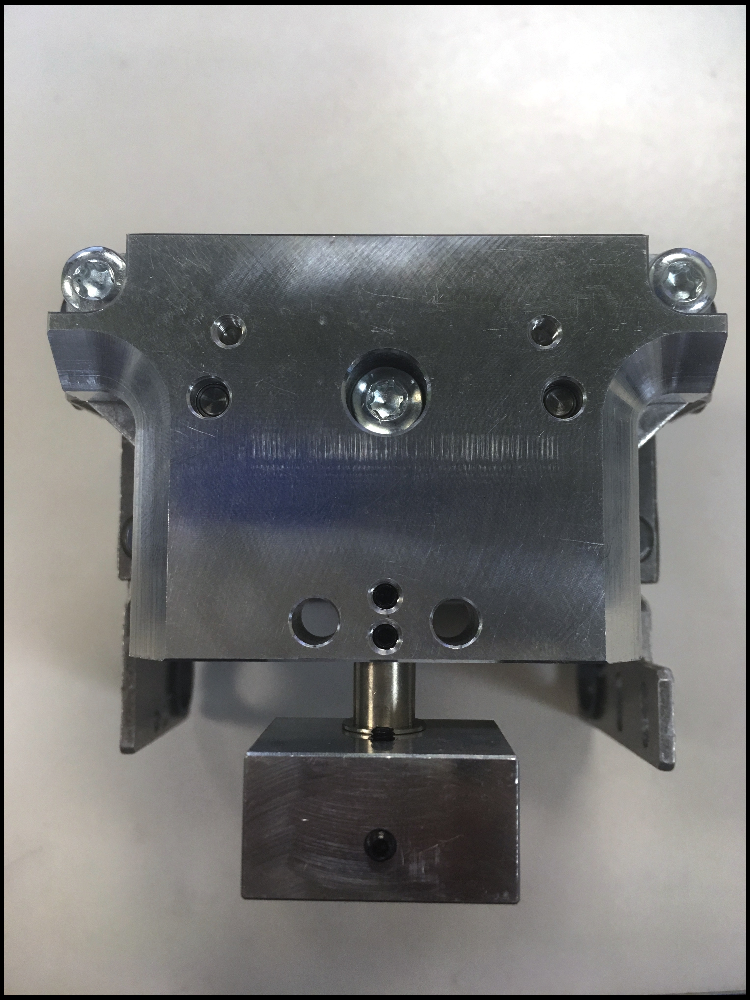

### Setup 2: Single K'tana

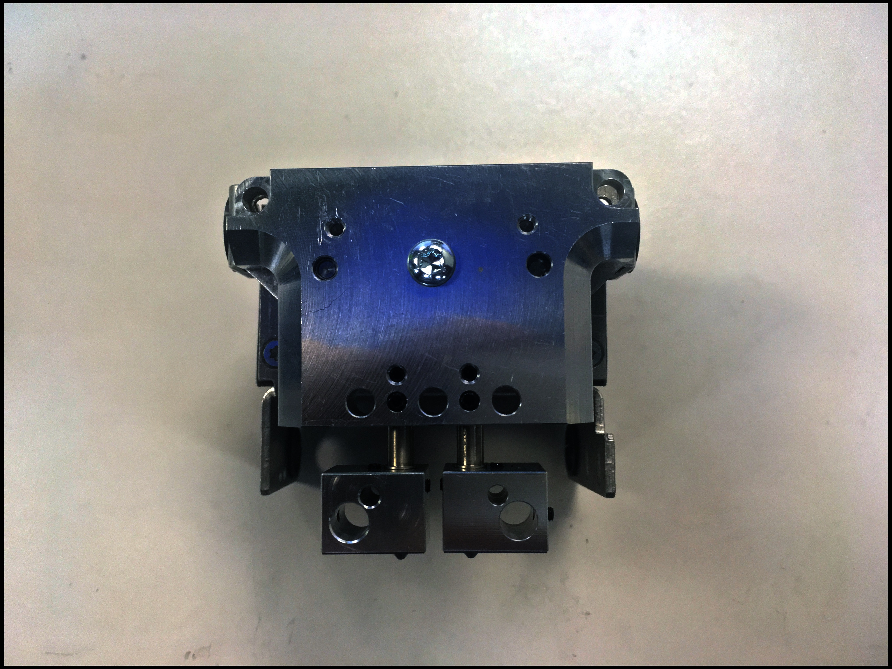

## Load Filament

### Move Extruder Toward Center

```text
G90
G1 X200 Y200
```

The block above is called G-code. Enter the G-code above.

#### Method 1: How To Input G-code

Search for Text Bar.

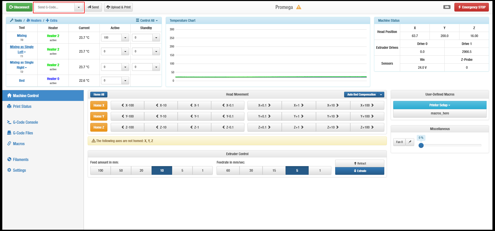

Input ONE \(single\) line of G-code.


Hit Enter or press Send button.


#### Method 2: How To Input G-code

Go to G-code Console tab.

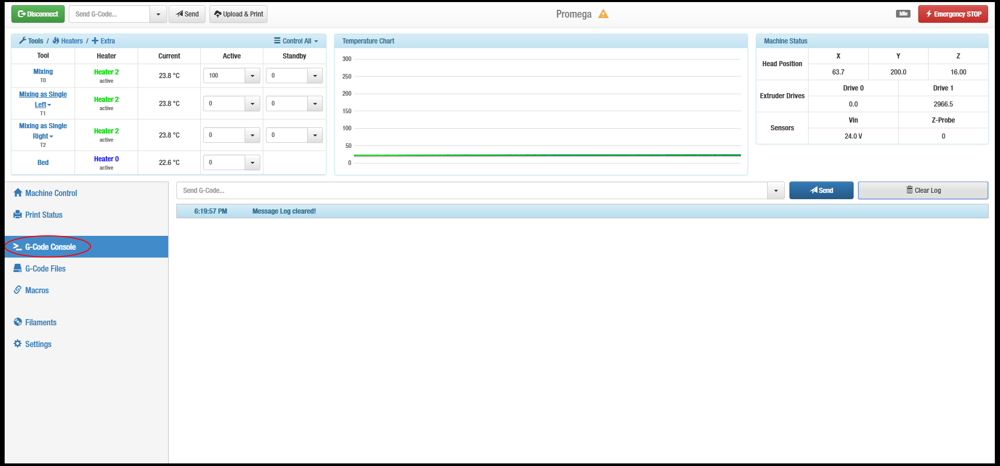

Search for Text Bar.

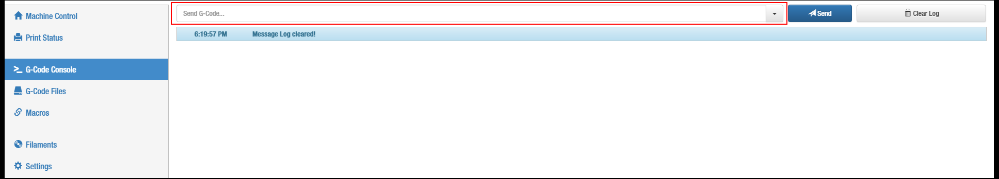

Input ONE \(single\) line of G-code.

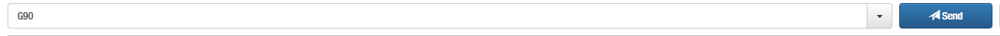

Hit Enter or press Send button.


### Heat The Nozzle

#### Mixing Compound

Select Mixing.

Check whether it is selected.

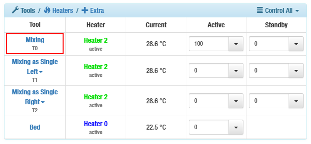

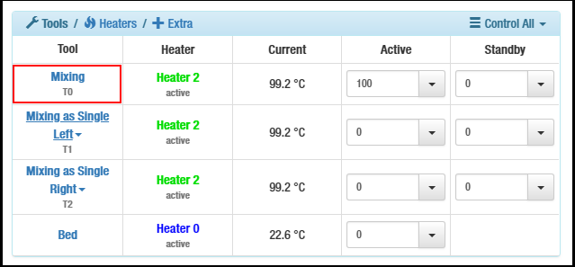

Type 205.

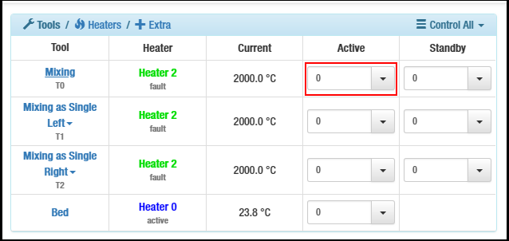

Hit Enter.

Wait until it reaches temperature.

#### Single K'tana

Select the right or left side

Type 205.

Hit Enter.

Wait until it completely heats.

### Catch The Filament

Locate filament entrance.


Locate Extruder Control


Press 10 Feed Amount Button

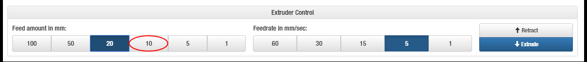

Insert Filament

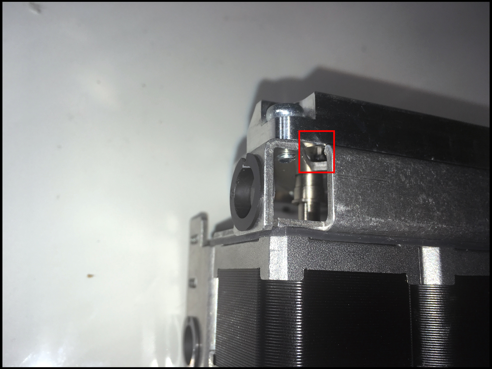

Press Extrude Button

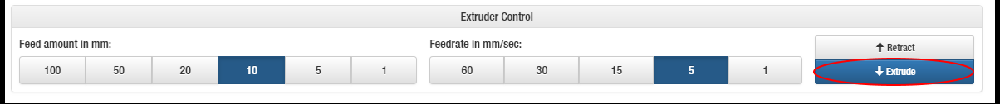

Moderately press filament into entrance.

Release when filament is pulled.

#### Mixing Compound

Make sure both filaments are caught.

**WARNING:** Do not continue to next step until BOTH filaments are caught. This will cause **a clog**.

#### Single K'tana

Make sure the heated side \(left or right\) has the filament.

### Extrude

Press 100 Feed Amount Button


Press 5 Feedrate Button

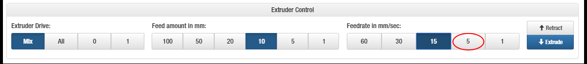

Press Extrude Button

Wait for the filament to extrude.


You are ready to set up your bed. 

