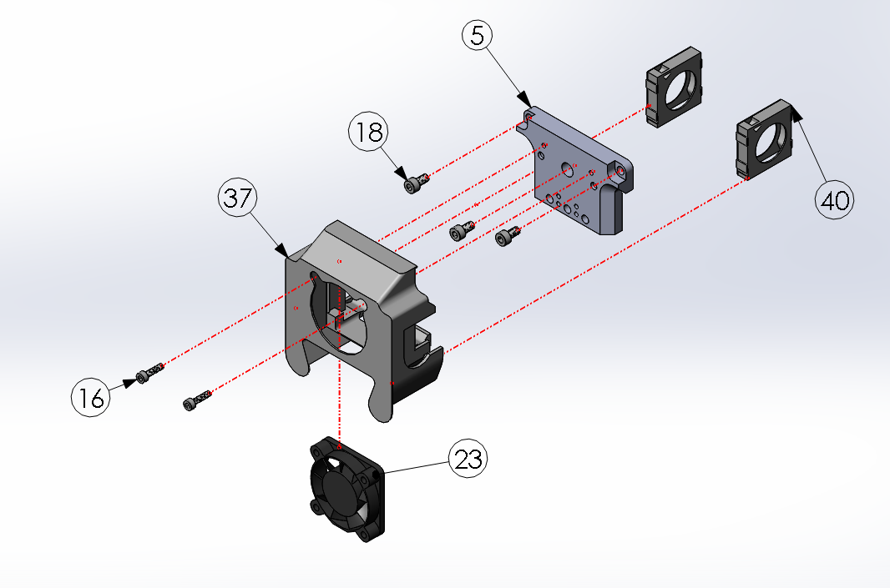
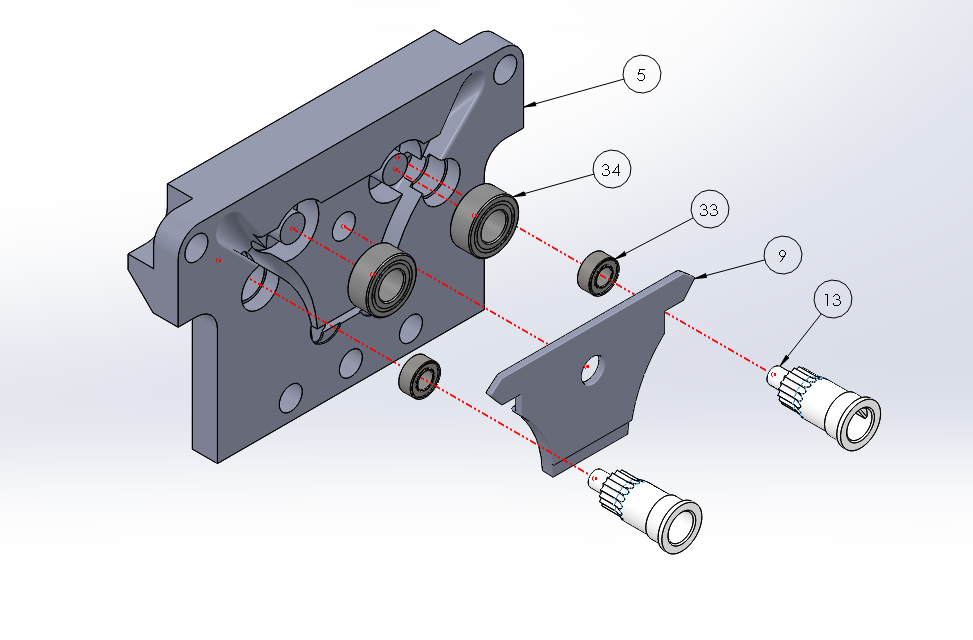
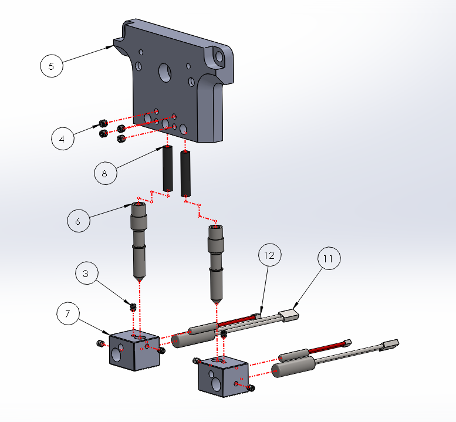

# Single K'Tana

## Front Components

| Balloon Number | Name | Quantity |
| :--- | :--- | :--- |
| 5 | Single K'Tana Wall-E | 1 |
| 16 | M3 x 12 mm Screw | 2 |
| 18 | M4 x 8 mm Screw | 3 |
| 23 | Cold Section Fan \(24V, 8.5 CFM\) | 1 |
| 37 | Fan Mount | 1 |
| 40 | Nozzle Fans \(Pair\) | 1 |

## Back Components

| Balloon Number | Name | Quantity |
| :--- | :--- | :--- |
| 5 | Single K'tana Wall-E | 1 |
| 9 | Single K'tana Plastic Insert | 1 |
| 13 | Extruder Gear | 2 |
| 33 | MR63ZZ Bearing | 2 |
| 34 | MR105ZZ Bearing | 2 |

## Hot-End Components

| Balloon Number | Name | Quantity |
| :--- | :--- | :--- |
| 3 | M2.5 x 3 mm Set Screw | 6 |
| 4 | M3 x 3 mm Set Screw | 4 |
| 5 | Single K'tana Wall-E | 1 |
| 6 | Single K'tana Nozzle | 2 |
| 7 | Single K'tana Heater Block | 2 |
| 8 | Single K'tana PTFE | 2 |
| 11 | Heater Cartridge | 2 |
| 12 | PT-1000 | 2 |

