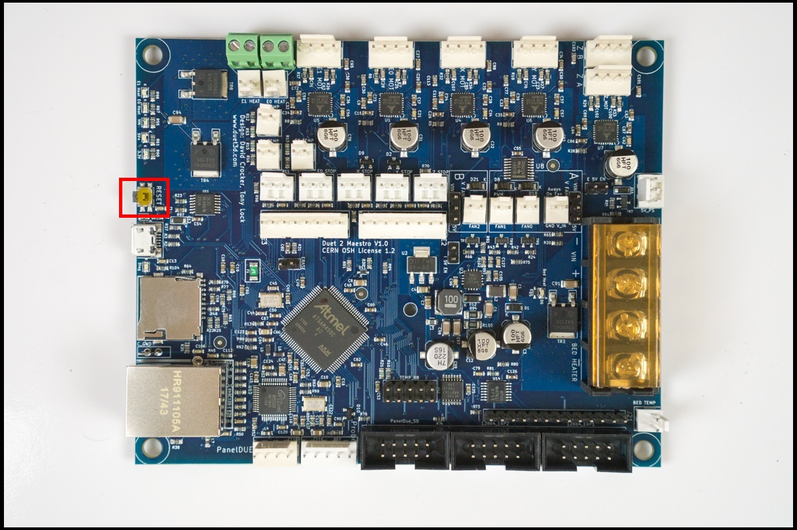
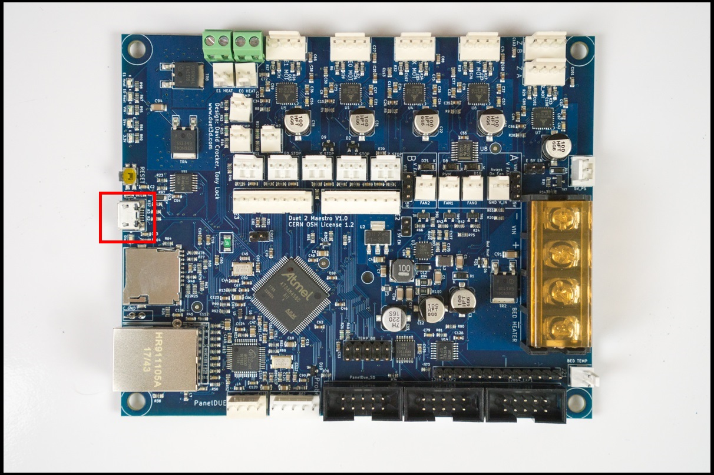
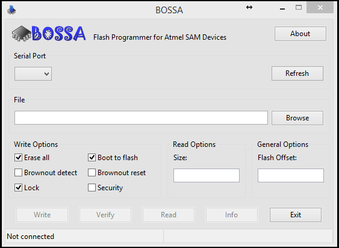
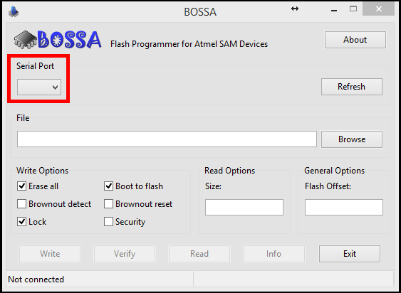
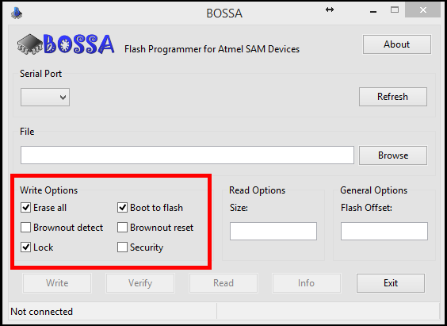
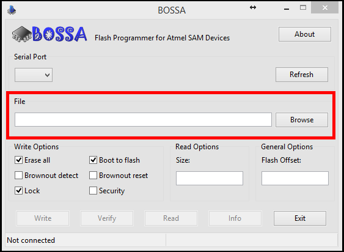
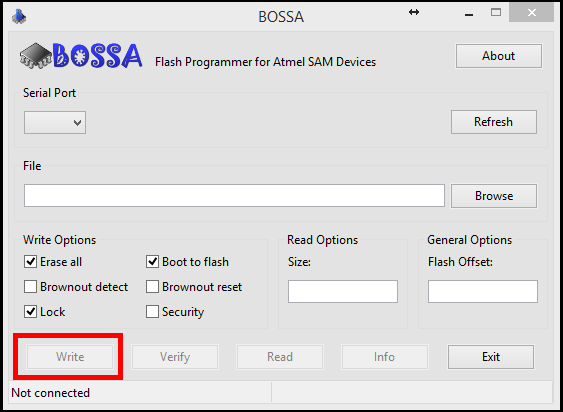

# Updating Firmware

Updating your firmware can be important to obtain the latest features and bug fixes. The Duet Maestro board uses a fork of RepRap firmware to control a 3D printer. The latest firmware can be found on DC42's [GitHub Page](https://github.com/dc42/RepRapFirmware/releases). There you can download the _.bin_ firmware files and, most importantly, read the change log. Note that some firmware releases are experimental and will be classified as an early-release. This means there is a higher risk of unintended bugs in the firmware version.

**Warning: Updating your firmware can cause unintended consequences. Be aware that upgrading or downgrading to unstable firmware versions can cause unexpected bugs and issues. Use caution!**

## Identify Firmware Version

In order to find out if you want to update the firmware on the Duet Maestro you need to find your current version. You can view the RepRap firmware version in the Duet Web Console Settings Tab. Alternatively, you can use `M122`, command `M122` is the diagnose/debug command for RepRap firmware. If you send command `M122` the board will display a lot of debug statistics. In the first few lines the board will print out what firmware version it is running. Based on your firmware version, you might be able to identify if you are encountering a specific bug. Check DC42's github page regularly in order to read the latest firmware changes and see if any would be useful to you.

## Upgrade: Via the Web Control

1. Download the desired firmware version from DC42's github page. This will be a _.bin_ or binary file called _DuetMaestroFirmware.bin_.
2. Download the _iap4s.bin_ file, this is necessary in order to update the firmware.
3. Go to the settings tab of the Duet Web Console and find the _Upload File\(s\)_ button. Note: this is not for uploading prints. Files uploaded here will be stored in the /_sys_ directory of the microSD card. Upload the _iap4s.bin_ and _DuetMaestroFirmware.bin_ files.

   

4. Once both files are uploaded successfully, go to the _G-code Console_. Send the command `M997 S0`. This will begin the process of upgrading Duet firmware.
5. When the firmware upgrade is completed, you can visit the _Settings_ tab in order to ensure that the _Firmware Version_ has been updated to the preferred version. 
6. If you prefer, you can now delete the _iap4s.bin_ and _DuetMaestroFirmware.bin_ files from the _sys/_ directory.

## Upgrade: Via the USB cable


You need an additional jumper. 


#### We are first going to erase the Duet board's firmware.

_**Turn Off**_ the Power Switch

Install the jumper into ERASE.

_**Turn**_ _**On**_ the Power Switch. 

Wait 3 seconds. Press the Reset button.

Wait 3 seconds. Turn Off the Power Switch.

Remove the ERASE jumper.

#### The firmware is now erased. Let's install the new firmware.

Connect your USB cable to the Duet Board & your computer.

Open the BOSSA program. 


If not installed, [download](https://github.com/shumatech/BOSSA/releases) here. Use version BOSSA 1.8.


Choose the correct COM port.

Check and/or Uncheck these boxes.

Link to the firmware.


The firmware file is probably in the _**Download**_ folder.


Press Write.

Done.

## Other Resources

1. [Duet 3D Wiki: Updating and Installing Firmware](https://duet3d.dozuki.com/Wiki/Installing_and_Updating_Firmware)
2. [Duet3D Forum](https://forum.duet3d.com/): For firmware and Duet specific questions
3. [Duet Fork of RepRap Firmware](https://github.com/dc42/RepRapFirmware)

