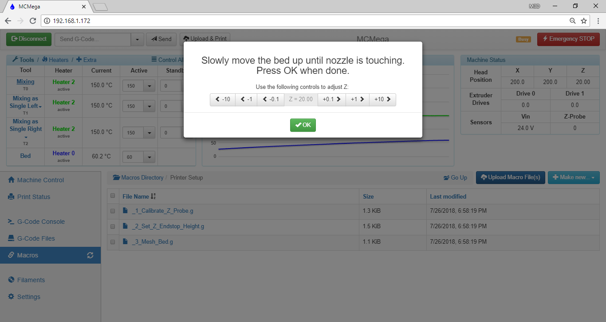

# Tuning the Z Homing Procedure


CAUTION: This procedure involves heating the nozzle to high temperatures.  Be very careful to not touch the nozzle or heater block, as they WILL BE HOT!



CAUTION: This procedure heats the print bed.  Do not touch the bed as it WILL BE HOT!


## Tuning the Z-homing: Automated Procedure

We offer an automated procedure for tuning the Z-homing in addition to a manual process.  \(A thank you goes out to our Promega community for developing these macros!\)  The automated procedure is preferred \(continue reading just below\), although if your printer encounters any issues during this process, the manual procedure steps at [Tuning the Z-homing: Manual Procedure](../getting-started/homing-the-printer.md#tuning-the-z-homing-manual-procedure) may help you troubleshoot the particular error.

**The relative distance between the bed and the nozzle depends on your Promega configuration \(K'tana vs. Compound, glass vs. no glass, etc.\)**  Ideally whenever you home the printer and send the command `G1 X0 Y0 Z0` \(telling the printer to go to \(0,0,0\)\) the print bed will touch the nozzle.  However, as outlined above, the relative distance between the bed and the nozzle varies depending on your setup.  Follow the steps below to update the Z configuration of your printer.

This procedure consists of four broad steps:

* Prerequisites are covered in step 1
* We calibrate the Z probe's location relative to the nozzle in steps 2 through 5
* We calibrate the full Z travel of the printer \(which depends on bed glass, nozzle installation, etc.\) in steps 6 through 10
* We perform a mesh bed leveling in step 11

1. Verify your printer configuration is up to date before completing this procedure.  In particular, make sure the configuration files _machine\_axisdimension.g_, _machine\_zendstop.g_ and _machine\_zprobe.g_ are present on the SD card, along with the macros _\_1\_Calibrate\_Z\_Probe.g_, _\_2\_Set\_Z\_Endstop\_Height.g_ and _\_3\_Mesh\_Bed.g_.  To verify: in the web interface, choose _Settings_ and then _System Editor_.  Scroll down and ensure _machine\_axisdimension.g_, _machine\_zendstop.g_ and _machine\_zprobe.g_ are present.  Next, choose _Macros_, look for a folder named _Printer Setup_, and ensure the three files _\_1\_Calibrate\_Z\_Probe.g_, _\_2\_Set\_Z\_Endstop\_Height.g_ and _\_3\_Mesh\_Bed.g_ are contained within.  If any of these files are missing, review the instructions at [Updating SD Card Structure](../getting-started/updating-sd-card-structure.md) to update your printer, then return to this page to tune the Z-homing procedure. 
2. First, we will teach our printer the vertical distance between the nozzle and the deployed Z probe.  **The Z probe should initially be stowed.  If the probe is deployed, please retract it now.**  Begin by running the _\_1\_Calibrate\_Z\_Probe.g_ macro: choose the _Macros_ tab in Duet Web Control, enter the _Printer Setup_ folder, and click the _\_1\_Calibrate\_Z\_Probe.g_ file entry.  Confirm you want to run the macro, then follow the onscreen prompts.      At times, the visual prompts may disappear while the printer continues to operate.  This is normal, and you should wait for the next dialog requiring user input. 
3. After homing, heating and bringing the bed within ~20 mm of the nozzle, the macro will ask for your input to move the bed so that it just makes contact with the nozzle.  Make sure your Z probe is stowed, then use the \(-\) buttons to move the bed closer to the nozzle.    A post-it note or similar sheet of paper can be a useful tool to check the distance between the bed and nozzle, but always be careful to avoid touching the hot nozzle or heater block.  The post-it will slide relatively easily until there is a 0.1 mm gap between the bed and nozzle.  If you step the bed closer to the nozzle in 0.1 mm increments, you can use the post-it note as a feeler gauge.  When you feel resistance to the motion of the post-it, remove it from the gap between the nozzle and bed.  If the post-it slides out from between the two without much resistance, we recommend moving 0.1 mm closer \(again, use \(-\) buttons\).  This dialog will show a Z= value, but it is not important at this point to make note of that value.  Once the bed and nozzle are touching, choose _OK_. 
4. Deploy the Z probe when asked.  Then, continue stepping through the automated process, following the on-screen prompts.            The printer will raise the bed until it just makes contact with the deployed probe, at which point the Z value in the _Machine Status_ display is a measure of the distance between the nozzle and the height at which the probe triggers.  **The next step will have you place this value in your machine configuration files so that the printer powers on with the proper Z calibration routines in the future.** 
5. Follow the on-screen prompts, making note of the Z value in the _Machine Status_ area of the Duet Web Control page.     ****In the example shown, the bed triggered the Z probe at a height of 5.74 mm.  We will now transfer this value to the configuration file _machine\_zprobe.g_.  After viewing the remaining prompts, choose the _Settings_ tab, then _System Editor_, and scroll down to the _machine\_zprobe.g_ file.  Click on the filename to open the file for editing.          Near the very bottom of the file, you will see a line that begins "G31" that we will update with our new Z offset value.  In the image above, you can see our printer had an old Z value of 7.51 mm.  Update the Z value by changing just the numeric part to the value from the _Machine Status_ area of Duet Web Control.  In our example, "Z7.51" changes to "Z5.74".  There is no space between the letter 'Z' and the numeric value.  Choose _Save Changes_ after you have updated the value.     
6. Next, we will teach our printer the precise distance the bed travels from the bottom of the printer, when it has just made contact with the Z maximum endstop, to the top of the printer \(Z=0\) where prints begin.  
  
   **The Z probe should be stowed.  If the probe is deployed, please retract it now.**  
  
   Run _\_2\_Set\_Z\_Endstop\_Height.g_: choose the _Macros_ tab in Duet Web Control, enter the _Printer Setup_ folder, and click the _\_2\_Set\_Z\_Endstop\_Height.g_ file.  When asked to confirm running the macro, choose _Yes_.  
  
       

   At times, the visual prompts may disappear while the printer continues to operate.  This is normal, and you should wait for the next dialog requiring user input.  

7. After homing, heating and bringing the bed within ~20 mm of the nozzle, the macro will ask for your input to move the bed so that it just makes contact with the nozzle.  Make sure your Z probe is stowed, then use the \(-\) buttons to move the bed closer to the nozzle.  \(The process is the same as what's described in step 3 above, if you would like more detail.\)  We have measured the adjustment necessary to the current configuration value for Z maximum extent.  **The next step will have you place this value in your machine configuration files so that the printer powers on with the proper Z calibration routines in the future.** 
8. Follow the on-screen prompts, making note of the Z value in the _Machine Status_ area of the Duet Web Control page.     ****In the example shown, the bed made contact with the nozzle at a height the printer believes to be 4.5 mm.  We need this contact to occur at a height the printer believes is actually 0 mm, meaning the Z extent programmed in the printer is currently 4.5 mm too large. 
9. We will use the value from the previous step to update the configuration files _machine\_zendstop.g_ and _machine\_axisdimension.g_.  After viewing the remaining prompts, choose the _Settings_ tab, then _System Editor_, and scroll down to the _machine\_zendstop.g_ file.  Click on the filename to open the file for editing.      Near the very bottom of the file, you will see a line that begins "G92" that we will update with our new achievable Z value.  In the image above, you can see our printer had an old Z value of 378.4 mm.  We need to update this with a value calculated as: $$new value = old value - step8value$$  For example: if the _machine\_zendstop.g_ file currently contains the command `G92 Z378.4` and I obtained a value of 4.5 mm, my new value would be 373.9 mm.  I would replace the current Z value in the G92 command so that the line reads `G92 Z373.9`   Choose _Save Changes_ after you have updated the value.      The values in _machine\_axisdimension.g_ implement safety and convenience features to avoid damage to the machine when everything is in working order and properly homed, and also need to be updated based on the result of step 8.  These values prevent your bed, for example, from attempting to travel a large distance beyond the physical extent of your printer \(sometimes known as "crashing"\).  Choose the _Settings_ tab, then _System Editor_, and scroll down to the _machine\_axisdimension.g_ file.  Click on the filename to open the file for editing.      Near the very bottom of the file, you will see a line that begins "M208 S0" that we will update with our new practical Z range.  In the image above, you can see our printer had an old Z value of 379 mm.  We will update the Z extent value contained in _machine\_axisdimension.g_ to reflect the achievable Z travel from step 8. In practice, we do the following: take the value just set in _config\_zendstop.g_, round to the next largest whole number, and set this value in _machine\_axisdimension.g_.  For example: we just set our Z value for the G92 command in _machine\_zendstop.g_ to 373.9.  We will therefore set the Z value in  _machine\_axisdimension.g_ to 374.      Choose _Save Changes_ after you have updated the value. 
10. For best results, we recommend repeating step 8.  In a properly calibrated printer, the resulting value of that process should be a Z of 0 mm.  If the value is not 0 mm, repeat step 9 using the attained value. 
11. Finally, we perform a multi-point bed probe to allow the printer to correct for small variances in the level and flatness of the bed.  Run _\_3\_Mesh\_Bed.g_: choose the _Macros_ tab in Duet Web Control, enter the _Printer Setup_ folder, and click _\_3\_Mesh\_Bed.g_.  When asked to confirm running the macro, choose _Yes_.      This macro takes several minutes to run.  Once completed, you will see a graphical view of the probing results.      These results are automatically saved and ready for use during this printing session and each time you power on the printer, so you have completed tuning your Z homing and no further action is necessary at this time.  If you'd like to learn more about mesh bed compensation, however, you can read more at [Bed Leveling & Probing](bed-leveling-and-probing.md).

## Tuning the Z-homing: Manual Procedure

**If you have already successfully run the procedure at** [**Tuning the Z-homing: Automated Procedure**](tuning-the-z-homing-procedure.md#tuning-the-z-homing-automated-procedure)**, you can ignore this section.  The automated process is the preferred procedure.  This manual procedure is meant to accomplish the same end result, but allows for additional diagnostics during the process, should they be required.**


Currently, this procedure is equivalent to steps 6 through 10 of the automated procedure above.  The calibration of Z probe relative to nozzle and running of the mesh bed level are not covered here.


**The relative distance between the bed and the nozzle depends on your Promega configuration \(K'tana vs. Compound, glass vs. no glass, etc.\)  The macro** _**machine\_zendstop.g**_ **allows for Z0 to line up properly.  We recommend tuning this macro once after receiving your printer, as well as following any configuration changes to the printer \(such as extruder style or print surface change\).**

Ideally whenever you home the printer and send the command `G1 X0 Y0 Z0` \(telling the printer to go to \(0,0,0\)\) the print bed will touch the nozzle.  However, as outlined above, the relative distance between the bed and the nozzle varies depending on your setup.  Follow the steps below to update your _machine\_zendstop.g_ file.

1. Verify your printer configuration is up to date before completing this procedure.  In particular, make sure the file _machine\_zendstop.g_ is present on the SD card.  To verify: in the web interface, choose _Settings_ and then _System Editor_.  Scroll down and ensure _machine\_zendstop.g_ is present.  If it is not, first review the instructions at [Updating SD Card Structure](../getting-started/updating-sd-card-structure.md) to update your printer, then return to this page to tune the Z-homing procedure. 
2. Home the printer if you have not already done so \(see [Homing the Printer](../getting-started/homing-the-printer.md#homing-the-printer)\). 
3. Send the command `G29 S2` to disable bed leveling.  Bed leveling can conflict with your homing value. 
4. Move the printer to a height of Z = +10 mm with the command `G1 Z10`  
5. Move the print head toward the center with `G1 X200 Y200`  
6. Jog the bed up the nozzle with the buttons in machine control until the bed is touching the nozzle.  Use the _Z1mm_ and _Z0.1mm_ buttons.  Remember that you are about 10mm away from the nozzle.

     

7. Once the bed is properly touching the nozzle record the Z-value in _Machine Status_ on the Duet Web Console_._  This value will be used in the next step. 
8. Open the _machine\_zendstop.g_ file in the _Settings_ tab of Duet Web Control.  This file is called during the homing process of the Z-axis.  Find the `G92` command at the end of the file.  This command sets the z-axis height when the bed is moved completely away from the nozzle \(that is, it is at the bottom of the printer and has triggered the Z maximum endstop\). 
9. Update this value with the following formula:  $$new value = old value - step6value$$ For example: if the _machine\_zendstop.g_ file currently contains the command  `G92 Z376.4` and I obtained a value of -0.6, my new value would be 377mm.  I would remove the current G92 command from the _machine\_zendstop.g_ file and replace it with`G92 Z377`  
10. Save the file and home the printer again.  Although you should now be able to enter the command `G1 Z0` , I don't recommend it.  Manually jog your bed to the nozzle again to ensure that Z0 is when the bed is touching the nozzle.

