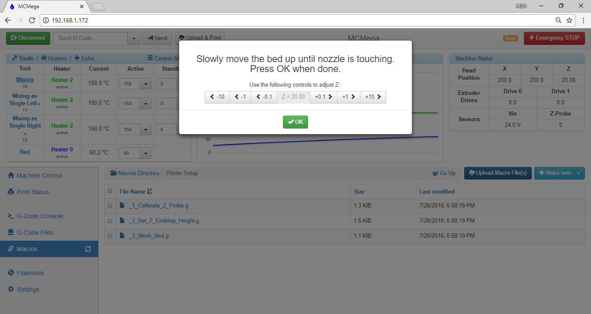
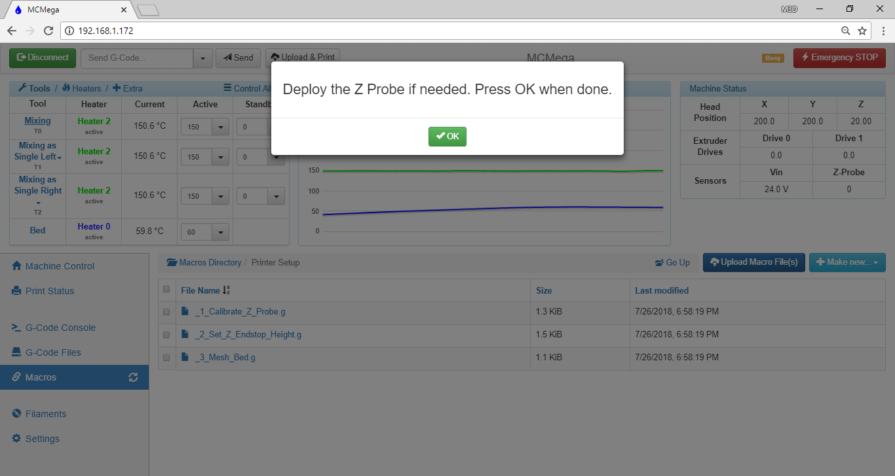

# Homing the Printer

Before you start printing or moving any component of the ProMega, we recommend homing the printer. Follow the steps below in order to home your printer. Prior to homing your printer check that the gantry and bed are able to move freely and access the limit switch. This guide assumes you have connected to the Promega as outlined in [Network Setup](network-setup.md).

## Printer Axes

In order to control the Promega it is important to understand the axes of the printer and their orientation. As you can see in the image above the X axis spans across the front of the printer from left to right if you are facing the front of the printer. The Y axis is pointing from the front to the back and the z-axis is pointing down. Remember these axes directions as you jog the printer with the _Machine Control_ tab in the [Duet Web Console](https://m3d.gitbook.io/promega-docs/getting-started/accessing-web-interface). **Positive Z is down and negative Z is up!**

The origin of this coordinate frame is in the top-front-left corner of the printer. This can be seen at the intersection of the three red axes of the 3D printer in the image above.

## The Homing Process

Follow the steps below to correctly home your printer.

### Checking the path

1. To ensure that the printer homes correctly, we recommend moving the coreXY gantry manually to the limit switches located in the back right corner when the motors are not powered. If you need to unpower the motors you can use the G-code command `M84` to stop the idle hold of the motors. Watch out as this will disable **all** motors, and could cause the bed to drop. Remove all items from inside of the printer before homing. The PTFE filament tubes on the extruder carriage cable assembly should be clicked in place \(shown in the image below\), or they could cause problems when homing the X-axis.

   

2. Move the coreXY gantry against the Y-limit switch, listen for the click of the limit switch. **Warning: when manually moving the gantry be careful not to move the extruder carriage past the limit switch tab as you can easily break it off**.

   

3. Then move the coreXY gantry against the X-limit switch.

   

4. Make sure the bed is resting on the Z-limit switch and that there is nothing underneath the bed.

### Homing the Printer

1. You are now ready to home the printer. There are multiple ways to initiate the homing process. You can press the _Home All_ button located in the _Machine Control_ tab of the Duet Web Console. You can also send the G-code command G28. These two operations will both execute the same file _homeall.g_, located on the microSD card.

   

2. The coreXY gantry should move toward the Y-limit switch located at the back of the printer first. Once it has hit that limit switch, it will move toward the x-limit switch. Next, the bed will lift itself up and back down slowly, until it has hit its limit switch.
3. Now all axes are homed. Remember that your motors are now powered and you will not be able to move any of the assemblies by hand. Use the `M84` command to temporarily disable idle hold current on your stepper motors, allowing you to move the motors. Your \(0,0,0\) is located at the top-front-left of the printer. 

## Tuning the Z-homing: Automated Procedure

We offer an automated procedure for tuning the Z-homing in addition to a manual process.  The automated procedure is preferred \(continue reading just below\), although if your printer encounters any issues during this process, the manual procedure steps at [Tuning the Z-homing: Manual Procedure](homing-the-printer.md#tuning-the-z-homing-manual-procedure) may help you troubleshoot the particular error.

**The relative distance between the bed and the nozzle depends on your Promega configuration \(K'tana vs. Compound, glass vs. no glass, etc.\)**

Ideally whenever you home the printer and send the command `G1 X0 Y0 Z0` \(telling the printer to go to \(0,0,0\)\) the print bed will touch the nozzle.  However, as outlined above, the relative distance between the bed and the nozzle varies depending on your setup.  Follow the steps below to update the Z configuration of your printer.

1. Verify your printer configuration is up to date before completing this procedure.  In particular, make sure the file _machine\_zendstop.g_ is present on the SD card, along with the macros _\_1\_Calibrate\_Z\_Probe.g_, _\_2\_Set\_Z\_Endstop\_Height.g_ and _\_3\_Mesh\_Bed.g_.  To verify: in the web interface, choose _Settings_ and then _System Editor_.  Scroll down and ensure _machine\_zendstop.g_ is present.  Next, choose _Macros_, look for a folder named _Printer Setup_, and ensure the three files _\_1\_Calibrate\_Z\_Probe.g_, _\_2\_Set\_Z\_Endstop\_Height.g_ and _\_3\_Mesh\_Bed.g_ are contained within.  If any of these files are missing, review the instructions at [Updating SD Card Structure](updating-sd-card-structure.md) to update your printer, then return to this page to tune the Z-homing procedure. 
2. First, we will teach our printer the vertical distance between the nozzle and the deployed Z probe.  **The Z probe, if using the limit switch, should initially be stowed.**  Begin by running the _\_1\_Calibrate\_Z\_Probe.g_ macro: choose the _Macros_ tab in Duet Web Control, enter the _Printer Setup_ folder, and click the _\_1\_Calibrate\_Z\_Probe.g_ file entry.  When asked to confirm running the macro, choose _Yes_, then follow the onscreen prompts.  At times, the visual prompts may disappear while the printer continues to operate.  This is normal, and you should wait for the next dialog requiring user input. 
3. After homing, heating and bringing the bed within ~20mm of the nozzle, the macro will ask for your input to move the bed so that it just makes contact with the nozzle.  Make sure your Z probe is stowed, then use the \(-\) buttons to move the bed closer to the nozzle.  A post-it note or similar sheet of paper can be a useful tool to check the distance between the bed and nozzle, but:  CAUTION: be very careful not to touch the nozzle or heater block, as they WILL BE HOT!  The post-it will slide relatively easily until there is a 0.1mm gap between the bed and nozzle.  If the post-it slides out from between the two without much resistance, we recommend moving 0.1 closer \(again, use \(-\) buttons\) and continuing at that point.  This dialog will show a Z= value, but it is not important at this point to make note of that value.  Once the bed and nozzle are touching, choose _OK_.  Deploy the Z probe when asked, then continue.        
4. The printer will raise the bed until it just makes contact with the deployed probe, at which point the Z value in the machine status is a measure of the distance between the nozzle and the height at which the probe triggers.  **This value will be placed in your machine configuration files so that the printer powers on with the proper Z calibration routines in the future.**  ... 
5. Next, we will teach our printer the distance the bed travels from the bottom of the printer, when it has just made contact with the Z maximum endstop, to the top of the printer \(Z=0\) where prints begin.  Run _\_2\_Set\_Z\_Endstop\_Height.g_: choose the _Macros_ tab in Duet Web Control, enter the _Printer Setup_ folder, and click the _\_2\_Set\_Z\_Endstop\_Height.g_ file.  When asked to confirm running the macro, choose _Yes_. 
6. Finally, we perform a multi-point bed probe to allow the printer to correct for small variances in the level and flatness of the bed.  Run \_3\_Mesh\_Bed.g: choose the _Macros_ tab in Duet Web Control, enter the _Printer Setup_ folder, and click _\_3\_Mesh\_Bed.g_.  When asked to confirm running the macro, choose _Yes_.  This macro takes several minutes to run.  Once completed, you will see a graphical view of the probing results.  These results are automatically saved and ready for use during this printing session and each time you power on the printer, so you have completed tuning your Z homing and no further action is necessary at this time.  If you'd like to learn more about mesh bed compensation, however, you can read our ...

## Tuning the Z-homing: Manual Procedure

**If you have already successfully run the procedure at** [**Tuning the Z-homing: Automated Procedure**](homing-the-printer.md#tuning-the-z-homing-automated-procedure)**, you can ignore this section.  The automated process is the preferred procedure.  This manual procedure is meant to accomplish the same end result, but allows for additional diagnostics during the process, should they be required.**

**The relative distance between the bed and the nozzle depends on your Promega configuration \(K'tana vs. Compound, glass vs. no glass, etc.\)  The macro** _**machine\_zendstop.g**_ **allows for Z0 to line up properly.  We recommend tuning this macro once after receiving your printer, as well as following any configuration changes to the printer \(such as extruder style or print surface change\).**

Ideally whenever you home the printer and send the command `G1 X0 Y0 Z0` \(telling the printer to go to \(0,0,0\)\) the print bed will touch the nozzle.  However, as outlined above, the relative distance between the bed and the nozzle varies depending on your setup.  Follow the steps below to update your _machine\_zendstop.g_ file.

1. Verify your printer configuration is up to date before completing this procedure.  In particular, make sure the file _machine\_zendstop.g_ is present on the SD card.  To verify: in the web interface, choose _Settings_ and then _System Editor_.  Scroll down and ensure _machine\_zendstop.g_ is present.  If it is not, first review the instructions at [Updating SD Card Structure](updating-sd-card-structure.md) to update your printer, then return to this page to tune the Z-homing procedure. 
2. Home the printer if you have not already done so \(see [Homing the Printer](homing-the-printer.md#homing-the-printer) section above\). 
3. Send the command `G29 S2` to disable bed leveling.  Bed leveling can conflict with your homing value. 
4. Move the printer to a height of Z = +10 mm with the command `G1 Z10`  
5. Move the print head toward the center with `G1 X200 Y200`  
6. Jog the bed up the nozzle with the buttons in machine control until the bed is touching the nozzle.  Use the _Z1mm_ and _Z0.1mm_ buttons.  Remember that you are about 10mm away from the nozzle.

     

7. Once the bed is properly touching the nozzle record the Z-value in _Machine Status_ on the Duet Web Console_._  This value will be used in the next step. 
8. Open the _machine\_zendstop.g_ file in the _Settings_ tab of Duet Web Control.  This file is called during the homing process of the Z-axis.  Find the `G92` command at the end of the file.  This command sets the z-axis height when the bed is moved completely away from the nozzle \(that is, it is at the bottom of the printer and has triggered the Z maximum endstop\). 
9. Update this value with the following formula:  $$new value = old value - step6value$$ For example: if the _machine\_zendstop.g_ file currently contains the command  `G92 Z376.4` and I obtained a value of -0.6, my new value would be 377mm.  I would remove the current G92 command from the _machine\_zendstop.g_ file and replace it with`G92 Z377`  
10. Save the file and home the printer again.  Although you should now be able to enter the command `G1 Z0` , I don't recommend it.  Manually jog your bed to the nozzle again to ensure that Z0 is when the bed is touching the nozzle.

Continue on to the [Heating the Bed and Nozzles](https://m3d.gitbook.io/promega-docs/getting-started/heating-the-bed-and-nozzles), the next chapter in the [Getting Started](https://m3d.gitbook.io/promega-docs/getting-started) guide.

