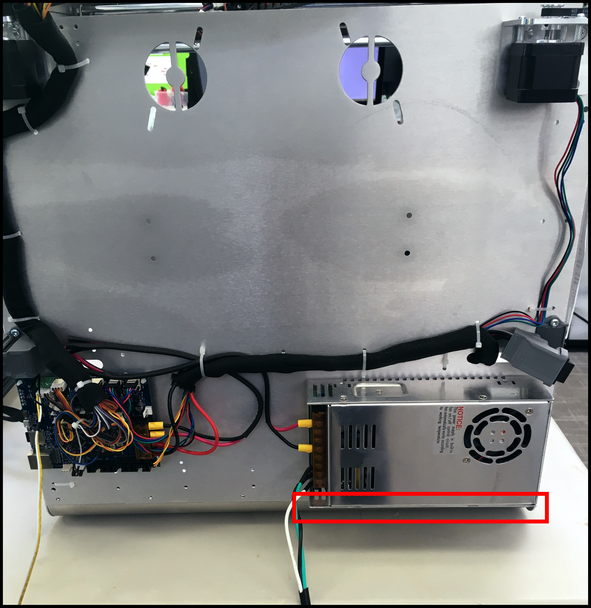

# Setup Your Electronics

## Check Your Power Supply's Input Voltage


Failure to do so will DAMAGE the power supply.


There are two input wall voltages: 115V or 230V. Choose the appropriate settings.



### How To Switch Between Voltages

The switch, used to flip between 115V and 230V, is located on the bottom part of the power supply.

Use a flat head to manually slide the switch. The current state of the switch is labeled.

## Your SD Card

### Accessing the microSD

Updating any configuration or G-code files without connecting to your printer is possible by changing the required files on the microSD card. The microSD card is located in a microSD port on the ProMega's Duet Maestro board. By pushing the microSD card into the board, as the arrow indicates in the image below, the microSD card will be released from the board. The microSD port and the Duet Maestro are sensitive, so be careful when removing microSD cards.

You can plug the microSD card into the microSD card reader included with your Promega. The microSD card reader can then be plugged into your computer's USB port. The microSD card should then appear as a drive to your computer. You will now be able to download and change any of the files on this card.

### Introduction Video

On the microSD card you will find numerous introductory files and a video. Review these materials!

Whenever you are done changing files on the microSD card it is best to safely eject the card and insert it back into the board. It is best to remove and insert the microSD card when the board is powered off. Continue to the Network setup guide with the button below.

