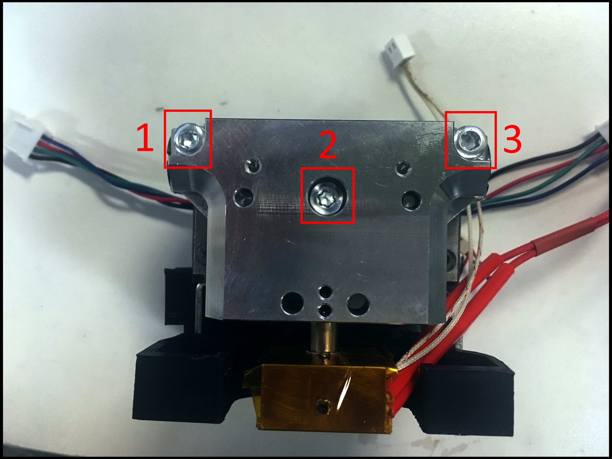
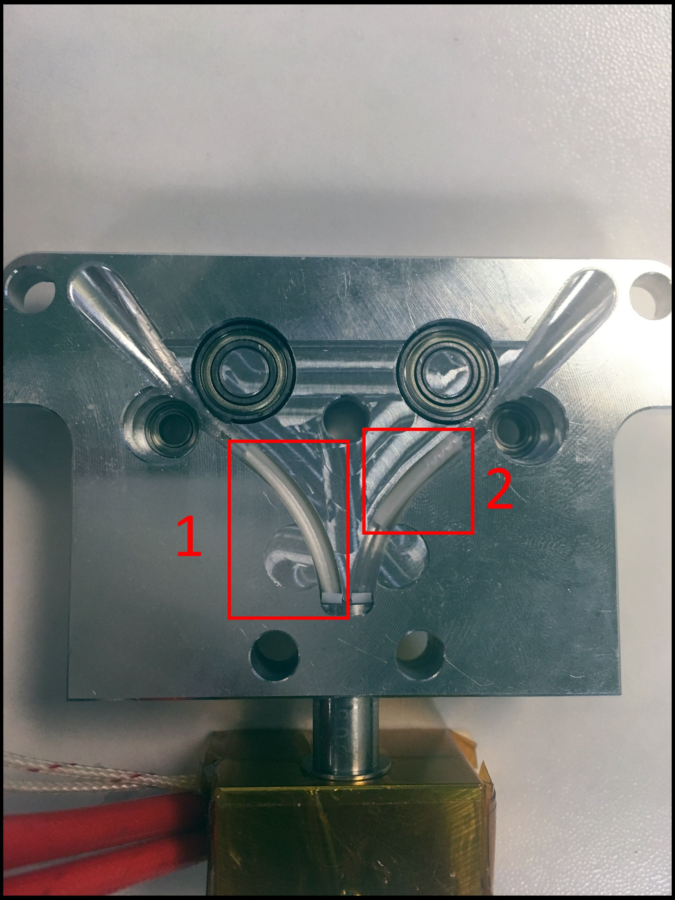

# Extruder

## Grinding: One Side Keeps Grinding.

### Problem

Only left or right side of my extruder keeps stripping when extruding.

### Solution

#### Wall-E may be tightened, in a skewed position.

Make sure both ports have filament inserted.

Loosen all three M4 screws.



Look for a shift in the Wall-E position, when loosening. The Wall-E should shift into its natural position, if not already all there.

Lightly tighten the all M4 screws.

Extrude again for 400 mm \(minimum\). Look for a grinding.

If still skipping, continue reading. 

#### There may be artifacts in your filament path.

Remove the Wall-E. Follow the [Uninstall Extruder](../repair-and-maintenance/install-uninstall/extruder.md#how-to-uninstall) guide.

Remove the plastic insert: [K'Tana](../documentation/mechanical-systems/single-ktana.md#back-components) or [Compound](../documentation/mechanical-systems/compound-mixing.md#back-components).

Look for artifacts.



## Skipping: No Extrusion. All Skipping.

### Problem

I hit extrude. Nothing comes out.

OR

I hit extrude. Only one side extrudes.

### Solution

#### There may be artifacts in your filament path.

Remove the Wall-E. Follow the [Uninstall Extruder](../repair-and-maintenance/install-uninstall/extruder.md#how-to-uninstall) guide.

Remove the plastic insert: [K'Tana](../documentation/mechanical-systems/single-ktana.md#back-components) or [Compound](../documentation/mechanical-systems/compound-mixing.md#back-components).

Look for artifacts.


## Skipping: Extrudes, but Skips

### Problem

I am extruding and keep hearing skipping sounds.

### Solution

#### Check your extrusion settings.

Run:

```text
M92; Displays motor steps.
M906; Displays current motor settings.
M350; Displays microstepping settings. 
```

_**Compound Mixing**_ Expected Settings:

```text
E Motor Steps: E195.0:191.5:####:####
Motor Current: E400:400:####:####
Microstepping: E128:128:####:####
```

_**Single K'Tana**_ Expected Settings:

```text
E Motor Steps: E198.82:197.00:####:####
Motor Current: E400:400:####:####
Microstepping: E128:128:####:####
```

