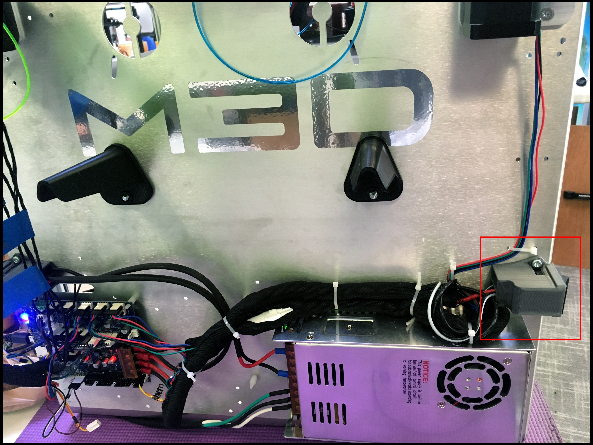

# Heater

## Heater Faults: Temperature Spikes

### Problem

The temperature has an impulse-like increase  - OR - erratic temperature changes. 

### Solution

There is a faulty wire connection. 

Replace PT1000 sensor. 

If replacement does not work, replace PT1000's wire extension. The wire extension is a long wire housed in the [cable chain](../repair-and-maintenance/install-uninstall/cable-chain.md) that extends from the extruder to the Duet board.

## Heater Faults: Temperature Not Rising Fast Enough

### Problem

Heater starts rising in temperature. Then the Duet Web Control \(DWC\) throws a fault, stopping the heating process and/or the print.

### Solution

You need to tune your heater.

Let the heater cool to room temperature.

Make sure you have some space \( estimated: 20 mm\) between the bed and nozzle. We'll will be heating up the heater.

Run:

```text
M562; Removes the fault.
M303 H# S260; Starts heater AUTO-TUNING Heater #. H# is the faulted heater's number.
```

Example: A fault on heater 2.


```text
M562; Removes the fault
M303 H2 S260; Starts heater AUTO-TUNING on Heater 2.
```

Wait for the process to finish. 


Stay with the printer. Do Not Leave the printer unattended while the heater is tuning.


Run:

```text
M500; Saves auto-tuning results. Saved in config-override.g (under sys folder)
```

Open: config.g  \(Located in the sys folder, in your SD Card\).

Go to the last line of entire file.

Make a new line. Enter \(if not seen\):

```text
M501; This loads the new auto-tuning results at start up.
```


If you see this warning, **Ignore:**

No M501 command was executed in config.g

**Why:** 

You just entered the M501 command into the config.g. The changes to the config.g file will take effect after a restarting your printer.


## Heater Faults: Heating Suddenly Stops

### Problem

Everything is working fine. Then a Duet Web Console \(DWC\) suddenly throws this heater fault:

### Solution

Your highest, allowable heater temperature was passed.

Run:

```text
M143 H#; H# is faulted heater's number
```

The default maximum heater temperature is 320 C.

## Heater Faults: Temperature is 2000C!

### Problem

My temperature reads continuously reads 2000 Celsius.

### Solution

The PT1000 is completely disconnected.

Check your PT1000 cables are connected. Use the [Duet Maestro Wiring Diagram](https://duet3d.dozuki.com/Wiki/Duet_2_Maestro_Wiring_Diagram) to figure out which cable is that. If connected, continue.

Replace the PT1000.

## Bed Fault: Not Heating Up

### Problem

Your bed is not heating up uniformly or not heating up at all. 

### Solution

**Turn OFF the printer FIRST**

Check if your bed power switch is on. 



Check the screw terminals that connect the bed to the Duet. Check these terminals on both the Duet side and the heated bed side. It is possible that they loosened up and are not making proper connection. 


Feel the wires going into the terminals and move them around to see if they are loose. If they are open the terminal cover and screw them down tight again with a Phillips head screwdriver.

