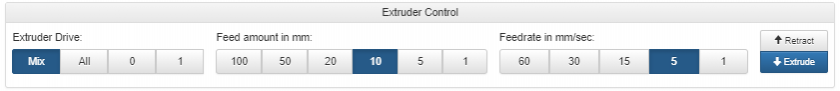

# Mesh Compensation

## My Bed Is Too Low or High

### Problem 

The nozzle is too high up from the bed. My filament has no chance of sticking to the bed.

OR

The nozzle is scraping against the bed.  Little or no filament is extruding. 

### Temporary Solution


This solution only applies during a print. 


Open the "Print Status" Tab.


Look for the "Z Baby Stepping" section.


Use the two buttons below. 

```text
+ 0.05 mm = Moving the Bed DOWN
- 0.05 mm = Moving the Bed UP
```


Use the buttons LIBERALLY. 0.05 mm increments are hard to visually see.

The goal is to manually set nozzle bed height to a desired level. 


Mesh grid compensation is NOT disabled. It is shifted, holistically. 


###  Solution

Your Bed Switch's Height Offset parameter not calibrated.

Follow the [Setup Bed Probe](../beginners-setup-guides/get-your-bed-ready.md) guide.

If you notice any skipping of the bed since the last time mesh compensation probing \(G29\) was preformed, follow the[ Read The Map](../beginners-setup-guides/get-your-bed-ready.md#map-the-bed) guide.

If not, proceed with printing.


Do Not Home The Z after performing a G30. Homing Z _**OVERRIDES**_ any bed level adjustments you just did with the bed probe.   
  
Homing Z serves 2 purposes: 

1\) Allow movements \(No movement can occur without homing first\).

2\) Used for power recovery.


## Bed Mesh Compensation Is Not Accurate

### Problem 

Mesh compensation is on and compensating, but the nozzle-bed height is still erratic. 

### Solution

Mesh compensation works within the mesh grid probe.

Check your print's location, with respect to the limits of the mesh grid.

Run:

```text
M557; Mesh Grid Parameters
```

The output should provide the mesh grid limits.

Example:

```text
Grid: X0.0:340.0, Y35.0:380.0, radius -1.0, X spacing 48.0, Y spacing 48.0, 64 points
```

X Minimum: 0

X Maximum: 340

Y Minimum: 50

Y Maximum: 380

## Cannot Find Heightmap.csv

### Problem 

Duet Web Console \(DWC\) throws an error during a print and/or during operation of the printer involving  Heightmap.csv



### Solution

Engage your bed limit switch.

Make sure your bed limit switch is calibrated. If not, follow [Setup Bed Probe](../beginners-setup-guides/get-your-bed-ready.md#setup-bed-probe) guide.

Next, follow the [Map The Bed](../beginners-setup-guides/get-your-bed-ready.md#map-the-bed) guide.

## Bed Mesh Compensation Is Not Activated

### Problem 

The z motor is not actively compensation for bed level variations.

### Solution

Enter code :

```text
M122
```

In the list, look for :

```text
Bed compensation in use:
```


If you see:

```text
Bed compensation in use: none
```

Enter:

```text
G29 S1
```


If you see:

```text
Bed compensation in use: mesh
```

The mesh compensation is activated. Bed compensation typically occur in fine, slow movements. The more angled your bed is, the more active the z-motor is. 

