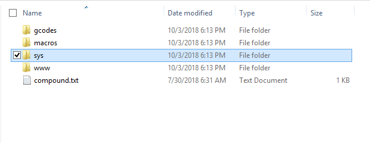
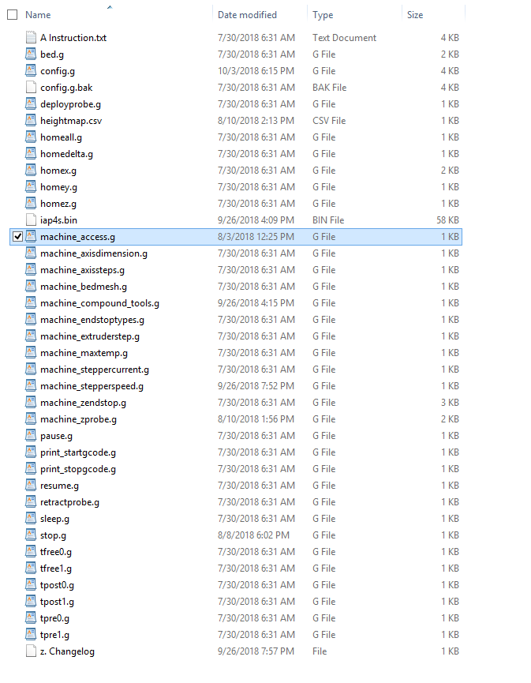
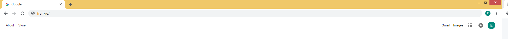
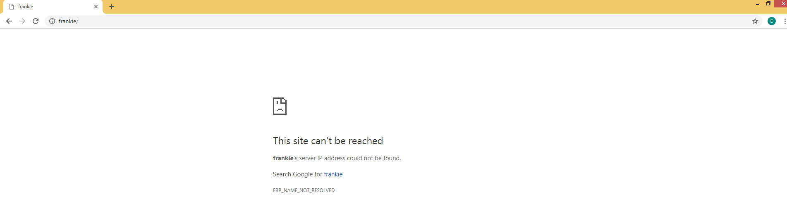
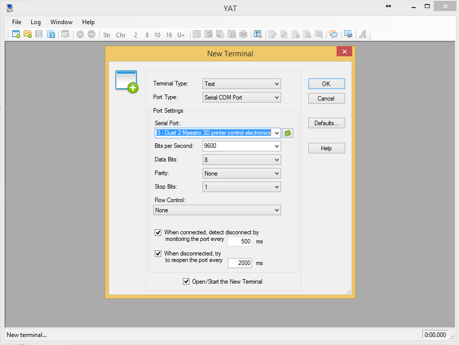

# Network Connection

This a complete troubleshooting procedure used to determine the issue behind any connection issues to Duet Web Control \(DWC\).

## DHCP  \(Default Setting\)

### Verify You Have DHCP

Open the "machine\_access.g" file \(located under _sys_ folder\). 





Locate the code: M552

Two things to check:

1. Look for this exact, matching code, with a single line. Dismiss anything after S1.

```text
M552 P0.0.0.0 S1
```

   2. Make sure the semicolon \(**;**\) character is not present before the M552, within the same line.

```text
; M552 P0.0.0.0 S1             ; DHCP - IS - enabled.
M552 P0.0.0.0 S1             ;   DHCP - IS NOT - enabled.
```

If any of these two items are not correct, you may be using a [Static IP](network-connection.md#static-ip).

### Verify IP Substitute Name

Open the "machine\_access.g" file \(located under _sys_ folder\). 

Locate the code: M550.

Your IP substitute name is:

```text
M550 P[here]
```

Example:

```text
M550 PFrankie
```

Enter the name into your web browser: 



Continue if the DWC could not connect:



### Verify IP Address

#### Follow Duet3D's [Official Getting Connected to Your Duet](https://duet3d.dozuki.com/Guide/1.%29+Getting+Connected+to+your+Duet/7) link.

OR

#### Here is simplified version:

Download [YAT](https://sourceforge.net/projects/y-a-terminal/).

Connect the Duet Maestro \(your board\) to your computer using the USB connection.

Open YAT.

Pick the correct COM\# port. Click "Okay"




If you want have to "Duet 2 Maestro 3D Printer ..." show up, follow the [Installing the Duet Driver](../documentation/software-firmware/duet-driver.md#how-to-install) guide.


Enter code \(into the bar labeled "Send Text"\):

```text
M552
```


Possible Response \#1:

```text
Network is enabled, configured IP address: 0.0.0.0, actual IP address: 192.168.1.##
```

You have a valid IP address. Enter the IP address \(e.g. 192.168.1.54\) into your web browser. 


Possible Response \#2:

```text
Network is disabled, configured IP address: 0.0.0.0, actual IP address: 192.168.1.##
```

Your network settings were disabled \(off\). 

Enter: 

```text
M552 S1
```

Re-evaluate response.


Possible Response \#3:

```text
Network is enabled, configured IP address: 0.0.0.0, actual IP address: 0.0.0.0
```

A 0.0.0.0 IP address means: the Duet \(board\) did not connect to the internet.

Check your internet connection. 

If you're sure the Duet \(board\) has internet connection, move on to the next step.


### Check SD Card 

Make sure the SD Card is installed into your Duet

{pic}


Do Not install or uninstall the SD Card when the printer is on. You May Burn the SD Card by doing this.


Return To YAT.

Enter:

```text
M21
```

#### Possible Response \#1 & \#2:

```text
[NOTHING]. Literally nothing.
```

OR

```text
No SD car present.
```

Your SD Card is not being read. 

Make sure the SD Card still works, by verifying you can still see the SD Card's content through your computer.

If you cannot, you need a new SD Card. Refer to [Updating SD Card](../getting-started-1/updating-sd-card-structure.md) for repopulating your new card.

If you can, we recommend reformatting the SD Card \(follow official Duet3D [microSD guidelines](https://duet3d.dozuki.com/Wiki/SD_Card)\).


**Possible Response \#3 & \#4:**

```text
SD Card mounted in slot 0, capacity ###.##Mb
```

OR

```text
SD Card has open file(s).
```

Your SD Card is being read. Move on to the next step.


### Check SD Card Content

Connect and open the SD Card to your computer.

Make sure your [root folder](https://gopro.com/help/articles/How_To/How-to-Find-the-Root-Level-of-Your-SD-Card) is exactly as shown below:


If not, re-organize until exact.

_OR_

_Delete-all_ and C_opy-Paste_ from [official Promega SD Card Content](https://github.com/PrintM3D/Promega/tree/devel/SD%20Card%20Structure).

Re-install the SD Card into the Duet board. Enter valid IP address or substitute name. 

## Static IP

Under construction. Coming Soon.

