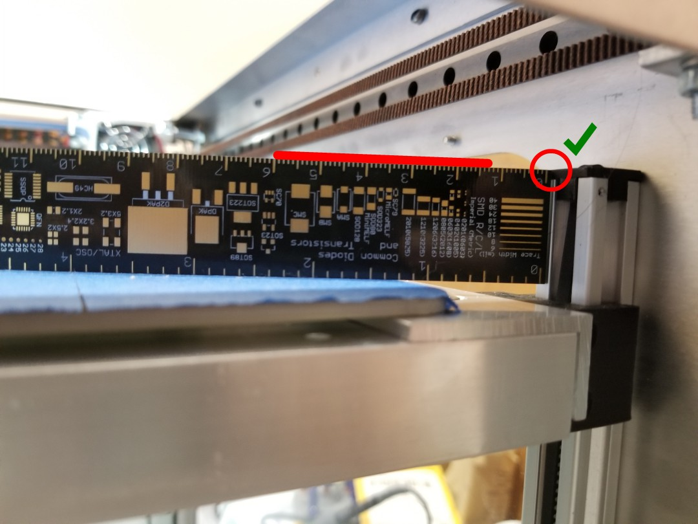
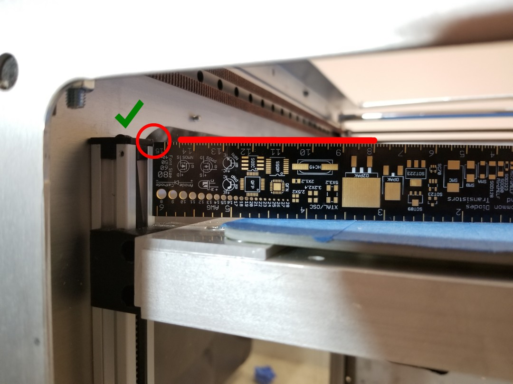
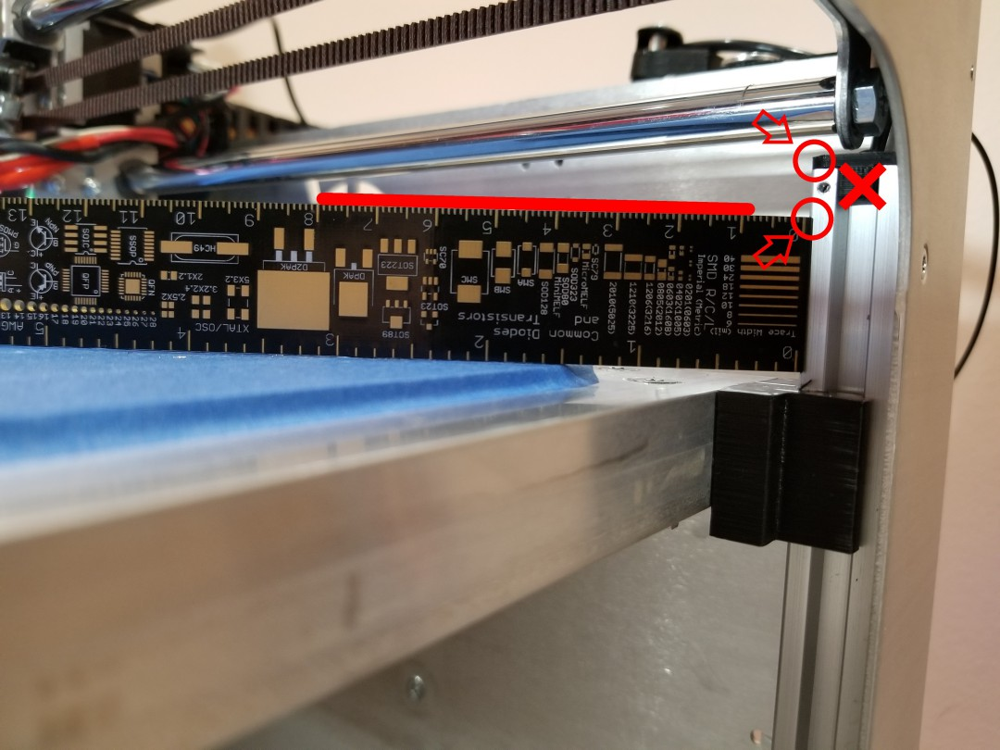

# Ruler Shortcut

## Synopsis

 This is a neat little trick if your bed is WAY far off, which can happen after it crashes \(or even just arrived misaligned like mine did\). I call this the "ruler shortcut" because it uses a ruler \(or other fairly flat, level object\) to take a significant amount of guesswork out of the bed levelling equation. In fact, I almost recommend this to start with, the worst thing it will do is get you close, but it will easily identify severe deviations in bed height.

## Step \#1 - Baseline

First things first, you'll need to grab an object \(in my case, a ruler\) that is fairly wide, lightweight, sturdy, and has a consistent thickness. It needs to be able to be placed on the bed, touching each Z rail, without any flexing of the object itself. Said object should also be at least one inch \(2.5 cm\) tall and at least four inches \(10 cm\) wide, though bigger still works. Other than a ruler, you can use a roll of blue tape, a small book, some cardboard boxes may work also. The goal is a consistent metric that will stay in place.

Next, raise your bed about two inches from the top. I recommend a throw pillow from a couch be placed underneath at this point -- if the bed crashes down, you want something to cushion the fall. Just that extra level of care to make sure we're levelling correctly here. Next, slowly raise the bed high enough so that resting this object on the Z rail makes it level with the top of it. **Keep a close eye on all four corners!** If one looks like you'll reach its limit, that corner should be your reference point that you place the ruler \(or other object\) against. Below is a picture of the "ruler shortcut" in action. Make note of how the top of the ruler is exactly touching the top of the Z rail. You may have to adjust the bed by 0.05 mm increments to get there. That's okay! We want the first corner to be exact, we will NOT be moving the bed for any other corners.

This is the baseline:

## Step \#2 - Example of "good enough"

Now that you have the baseline established, how will you know if other corners are "good enough"? Surprisingly, mine already is. In fact, I swapped pics \#1 and \#2 mid-way through writing this up after realizing the first corner I measured \(front left\) was slightly off, but the second corner I measured was spot on, without moving the bed. I manually moved the bed down about 20 mm for the last "needs adjustment" pic. But more or less, as a rule of thumb, "good enough" is when the corner is within twice the height of the black plastic cap, or 5 mm, of the top of the rail. If it is outside that range, it needs adjustment.

This corner, measured **without** moving the bed from the baseline \(remember, we do not move the bed at all once we set the baseline\), is "good enough". The bed mesh will take care of the rest.

## Step \#3 - Example of "needs adjustment"

So remember how above the "rule of thumb" was within 5 mm \(or twice the plastic cap's height\) of the baseline? If it's outside of that, you will want to pop the corner in the direction towards the baseline. The first GIF shown in \[[this link](../../repair-and-maintenance/mechanical-bed-leveling.md)\] visually shows you all you need to know for how to do it. For each tooth you skip, you will hear a very mechanical "click".

This pic shows a corner that clearly needs adjustment highlighting the top of the Z rail and the top of the ruler. This example is relatively minor, however I have seen some that are off by a full inch and a half \(i.e. three times this amount\) while the first two corners sync up well. This is why it's important to keep an eye on all four corners as you lift the bed for the baseline!

So now you know what the "ruler shortcut" is and why Shep says it's a seriously great thing to do if you ever have a bed crash, or even just as a general setup step!

