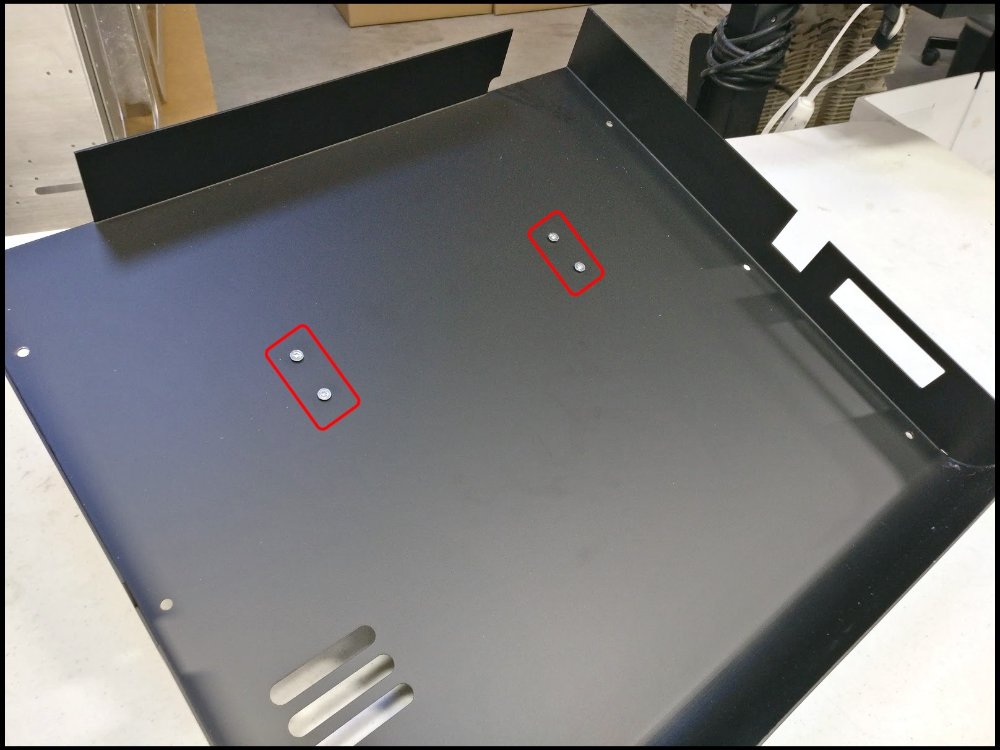

# Back Cover

## What is a Back Cover

## How To Install

### Mount Spools

Mount the Spool Holders to the Back Cover using the included M4 lock nuts and M4 flat head screws.  
****

### Mont Standoffs

Mount the Standoffs to the rear of the ProMega frame, using 4 of the included M4 pan-head screws on the inside rear of the ProMega frame.

### Slide Cover To Position

Carefully slide the Back Cover onto the back of the ProMega, making sure the cutouts for the power switches and power cable align properly  
****

Make sure not to pinch the wires coming out of the cable chain

### Secure Down Cover

Secure the Back Cover to the standoffs with the remaining M4 pan-head screws  
****

Add filament and enjoy!

