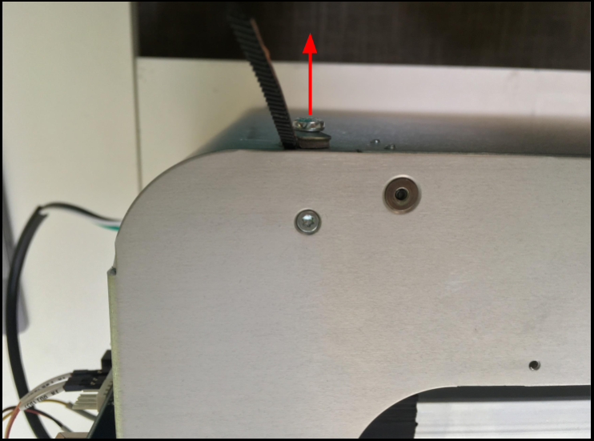
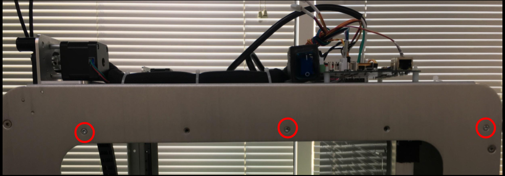
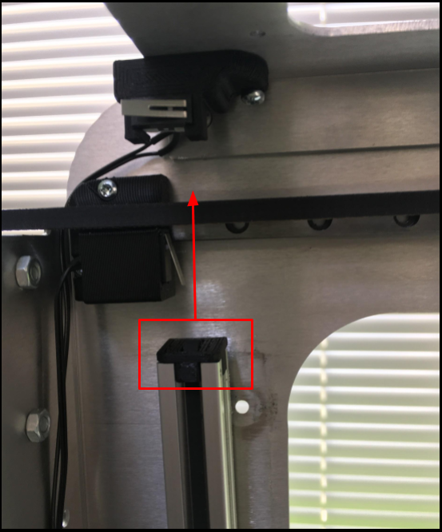
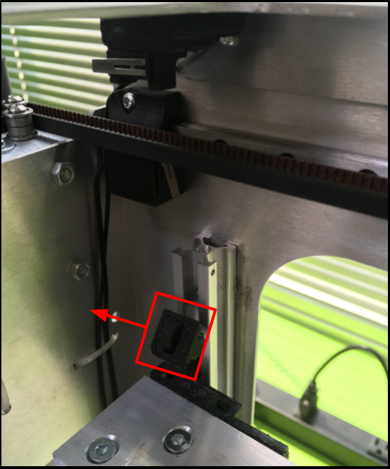
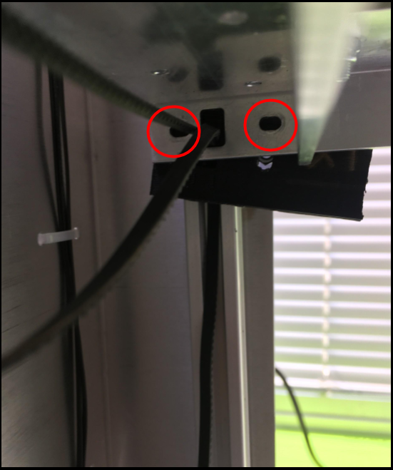
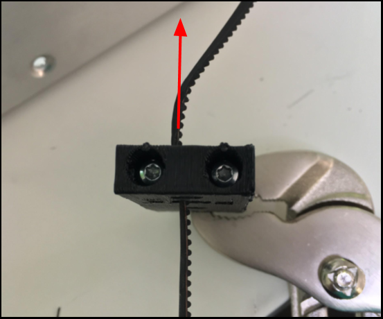

# Sliders

## How to Uninstall

### All versions

Pick a side

Loose the bottom M5 torx screw.

* Do not remove the screw.
* Loosen enough to remove the belt.

Loosen the bottom portion of the belt

Loosen all 3 M3 torx screws on the frame

* Removing them would be preferred, for easier installation

Remove the top z belt clamp.

Remove belt from the top z belt clamp.

Locate M3 screws from the slider.

 https://drive.google.com/file/d/1PKNWXd7lMsGXcWJgdArls8MtNZRaKhpN/view?usp=sharing 

Remove M3 screws from slider.

Pull sliders down.

Remove belts from the sliders.

## How To Install

### Version: ??

### Version: ??

Tap the M3 holes

Insert \_\_ Bearing

Screw in a M3 x \_\_ screw

Insert nut into slot

Insert \_\_ Bearing

Screw in a M3 x \_\_ screw

Insert nut into slot

Route belt into the slider

Move the slider into position

Pull loose belt tight

Snap belt into position.

Check for any tangled belts.

Screw in M3 x \_\_ screws

Route belt through the top z belt clamp

Insert top z belt clamp into rail.

Tighten top portion of the belt

Tighten bottom portion of the belt.

Route belt around bottom M5 screw

Tighten bottom M5 screw.

