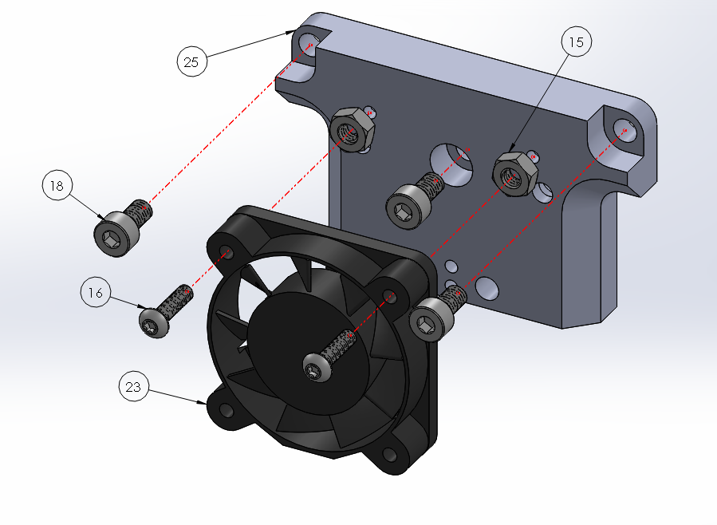

# WallE

## Front Components

| Balloon Number | Name | Quantity |
| :--- | :--- | :--- |
| 15 | M4 x 0.7 mm Nut | 2 |
| 16 | M3 x 12 mm Screw | 2 |
| 18 | M4 x 8 mm Screw | 3 |
| 23 | Cold Section Fan \(24V, 8.5 CFM\) | 1 |
| 25 | Mixing Compound Wall-E | 1 |

## Back Components

| Balloon Number | Name | Quantity |
| :--- | :--- | :--- |
| 13 | Extruder Gear | 2 |
| 25 | Mixing Compound Wall-E | 1 |
| 29 | Mixing Compound Plastic Insert | 1 |
| 33 | MR63ZZ Bearing | 2 |
| 34 | MR105ZZ Bearing | 2 |

## Hot-End Components

| Balloon Number | Name | Quantity |
| :--- | :--- | :--- |
| 3 | M2.5 x 3 mm Set Screw | 3 |
| 11 | Heater Cartridge | 1 |
| 12 | PT-1000 | 1 |
| 25 | Mixing Compound Wall-E | 1 |
| 26 | Mixing Compound Nozzle | 1 |
| 27 | Mixing Compound Heater Block | 1 |
| 28 | Mixing Compound PTFE | 1 |

