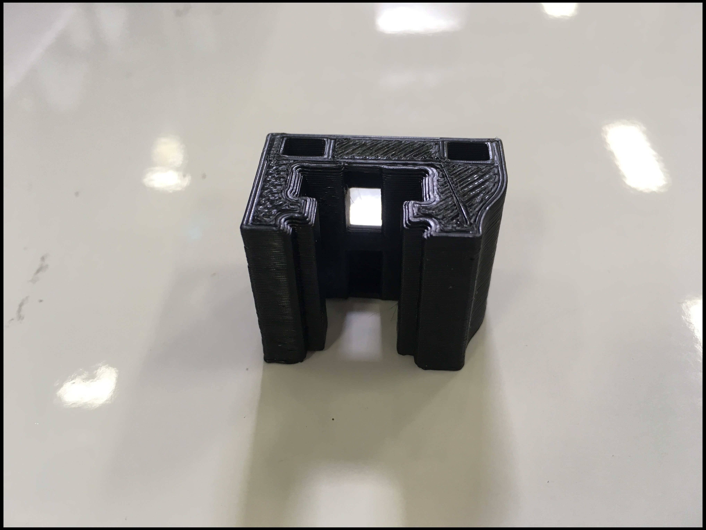

# Bed

For all printed part iterations, click [here](https://drive.google.com/drive/u/0/folders/1cmnAcQU7NjgBqAub60Pz7tJyY-e5qH1w).

## Exception:

_Z Bottom Belt Clamp: Housed here._

## Bed Terminal Cover:

### Current



### Legacy





## Z Bottom Belt Clamp:

### Current

* _**REMOVED**_

### Legacy







## Z Slider:

### Current



### Beta



## Z Top Belt Clamp:

### Current



### Legacy



