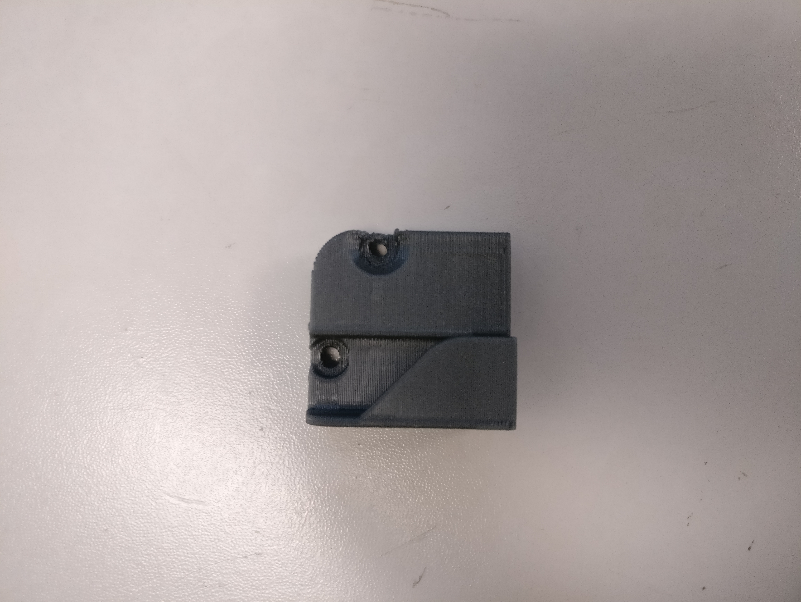

# Frame

For all printed part iterations, click [here](https://drive.google.com/drive/u/0/folders/1cmnAcQU7NjgBqAub60Pz7tJyY-e5qH1w).

## Exception:

* Z Bottom Belt Clamp: Housed inside "Bed".

## Bed & Power Switch Holder:

### Current



### Legacy



## Magnet Holder:

### Current





### Legacy

* _**NONE**_

## Spool Holder:

### Current



### Legacy

* _**NONE**_

## X Limit Switch Holder:

### Current



### Legacy



## Y Limit Switch Holder:

### Current



### Legacy



## Y Limit Housing XL:

### Current



### Legacy



## Z Limit Switch Holder:

### Current



### Legacy



## External Filter Fan

### Current



### Legacy

* _**NONE**_

