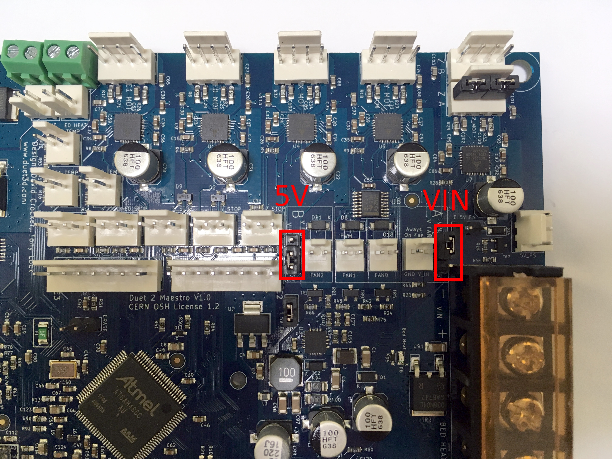

# Install

## What is the Quad Add-On?

## Tools

* T10 Screwdriver
* T20 Screwdriver
* Small Flat-Head Screwdriver
* Philips-Head Screwdriver
* Medium-size Pliers
* Adjustable Wrench 
  * Recommended: M6 Hexagonal Driver Bit \(for bolts\)


Details, on when to use them, as shown throughout the install guide.


## Additional Hardware

* Super Glue


Details, on when to use them, as shown throughout the install guide.


## How To Install

#### Turn off Power

#### Unplug Power Supply

#### Remove Wall-E




Tools:

* Small Flat-head Screwdriver
* T10 Screwdriver
* T20 Screwdriver


#### Remove Cable Chain




Tools:

* Philips Head Screwdriver


\*\*\*\*

#### **Unfasten Gantry Belt Clamp**




Tools:

* T20 Screwdriver


#### Remove X Axis System




Tools:

* T10 Screwdriver


#### Remove Extruder




Tools:

* Adjustable Wrench 
  * Recommended M6 Hexagonal Driver Bit \(for bolts\)


#### Prep Promega-Quad Adapter




Tools:

* Pliers
* T10 Screwdriver

Additional Hardware:

* Super Glue
* 2x Small Cylindrical Magnets \(Provided\)
* 2x M3 Locknuts \(Provided\)


#### Install Promega-Quad Adapter




Take the time to make sure your Promega-Quad Adapter slides smoothly.



Tools:

* Adjustable Wrench
  * Recommended: M6 Hexagonal Driver Bit \(for bolts\)


#### Prep Cable Chain




Tools:

* Small Flathead Screwdriver

Additional Hardware:

* Quad \(Long\) Motor Cables \(Provided\)


#### Prep Duet Maestro




Double check your electronics



Tools:

* Electronics Gloves \(recommended\)

Additional Hardware:

* Motor Expansion Board \(Provided\)


#### Install X Axis System




Tools:

* T10 Screwdriver


#### Loosen Motors




Tools:

* T10 Screwdriver
* T20 Screwdriver


#### Install Belts




Use a small Flat-head screwdriver to help with routing the belts through the idlers.



Tools:

* Small Flathead Screwdriver


#### Tighten Belts




Double check your X Axis System is straight.



Tools:

* _**NONE**_


#### Tighten Motors




Double check your X Axis System is straight.



Tools:

* T10 Screwdriver
* T20 Screwdriver


#### Install Quad




Use the small Flat-head screwdriver to move the M3 nuts to the correct position.



Tools:

* T10 Screwdriver
* Small Flat-head Screwdriver


#### Install Cable Chain




Tools:

* T10 Screwdriver


#### Connect Quad




Tools:

* T10 Screwdriver
* Small Flat-head Screwdriver


#### Adjust Bed Limit Switch




Tools:

* Small Flat-head Screwdriver


#### Check Wire Slack




Tools:

* Small Flat-head Screwdriver


#### Plug-in Power Supply

## Additional Electrical Changes

### Jumpers need to be re-positioned.

Before:

After:

### Fans need to be reconfigured.

Two Methods:

Change Fan Connections **\(Recommended\)**

Swap Crimps \(Advanced\)


### Proceed at own risk. Similar changes are done in-house by trained personnel for assembled Promega-Quads.

Make sure Promega is OFF during reconfiguration.




## Additional Software Changes

Go to [GitHub](https://github.com/PrintM3D/Promega)

Download the Promega Source File.

Delete ALL content in SD Card.

Go to .../Downloads/promega-devel/Promega-devel/SD Card Structure/Quad.

Copy ALL and paste into SD Card.

Ready For Printing.

