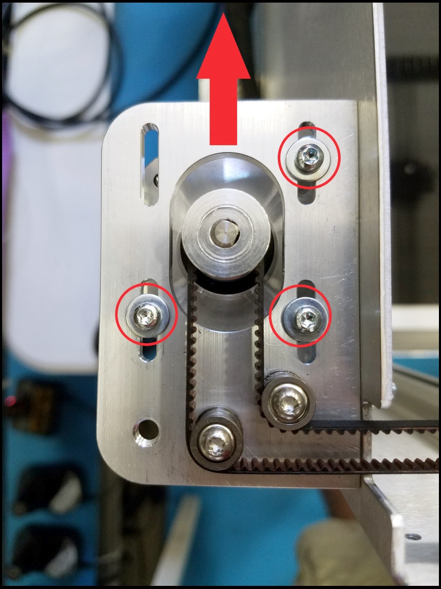
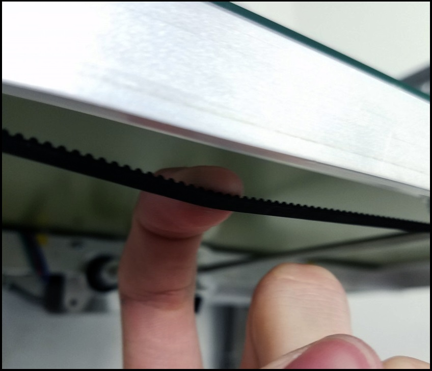
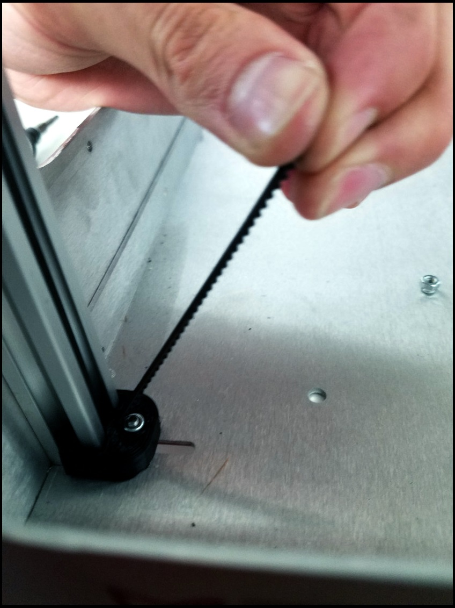

# Belt Tensioning

As the Promega is used over time it is possible slack develops in the CoreXY or Z-assembly belts. This can be fixed easily by following the guides below. Properly tensioning your belts will address problems with backlash and XY skipping.

## CoreXY Tuning

In order to tension the CoreXY loosen the three screws as indicated below.

Once the screws are loosened you should be able to pull the motor to tension the belts. Pull in the direction of the arrow. 


You will **not** need to pull very hard to tension these belts, around 2 lb of force is sufficient. 


Strum the belts near the extruder assembly to get an idea of the tension applied to the system by pulling the motor. Once you are satisfied with the tension, tighten the M3 screws back down.

Apply this same process to the other CoreXY motor.


Be sure to tension this belt system with the _**same amount of force.**_ 

You can misalign the extruder carriage gantry and your coreXY system will not be square. 


To check that your system is properly square, align the extruder gantry with the front frame of the Promega as shown in the image below. 

The extruder gantry shaft should be parallel to the frame. If one side is off, your system is not square and you will have to readjust tension. 

In the image below you can see a coreXY assembly that is not square. The left side is not pulled in as far as the right side. This is because the right side of the gantry is being tugged backwards harder than the left. The solution would be to tension the right side tighter.

## Other CoreXY Tuning Links



## Z-assembly

### Tensioning the Belts

In order to gauge the tension of the Z-axis belts you can pull down on the belt as pictured below. 

#### Determining the proper tension on the Z-axis belt is difficult. 


More tension gives more accuracy, _**but**_ can cause too much friction for the Z-motor to handle.


It is a careful balance and you will become more familiar with the proper tension over time. While pulling on the belt check that the top and bottom clamps are gripping the belt firmly. 

#### You should see no evidence of slipping.

To tension the belt pull up as shown in the picture below, while tightening down the screw underneath the Promega. 


You should not have to pull hard to achieve the proper tension as tightening down the clamp can tension the belt.


