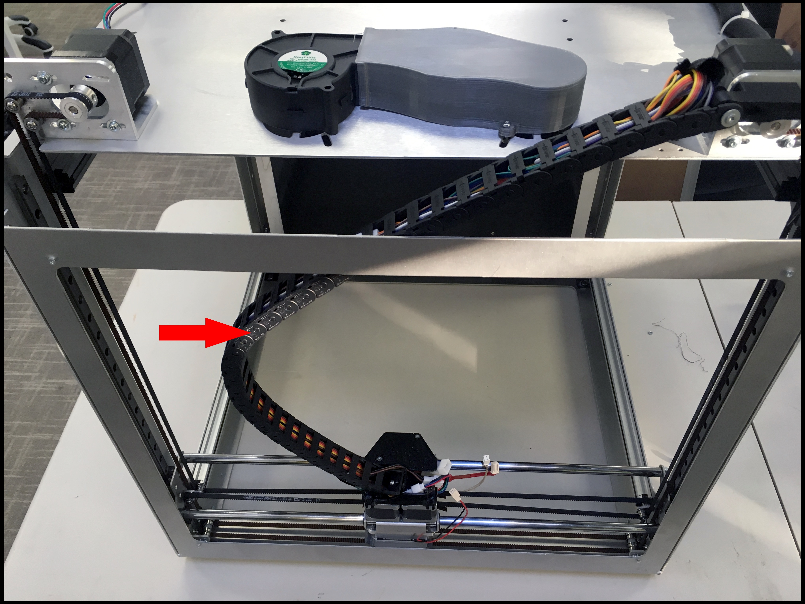
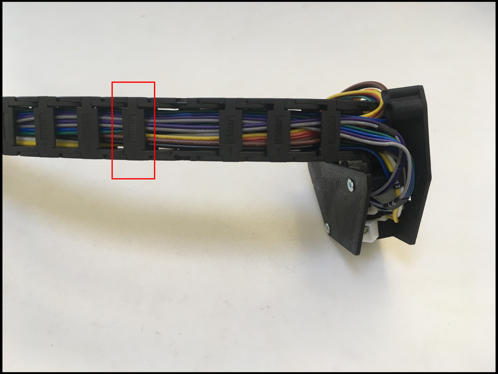
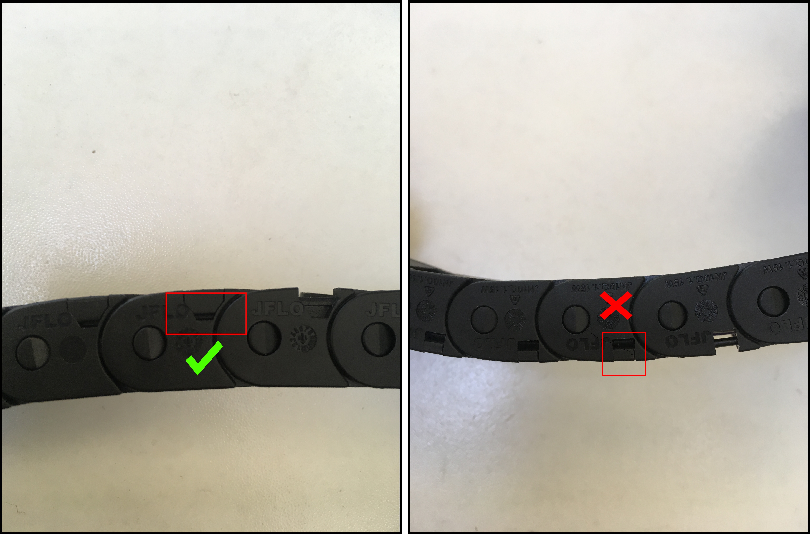
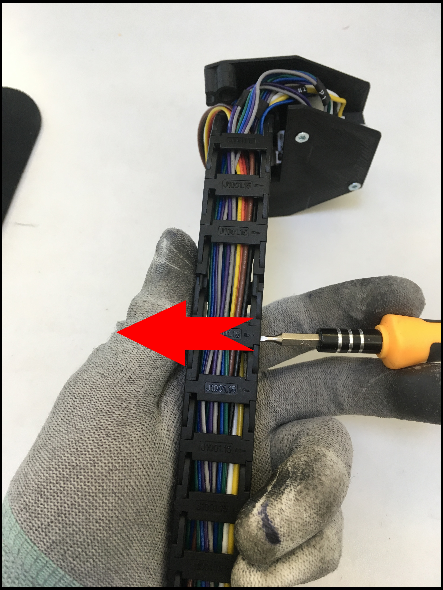
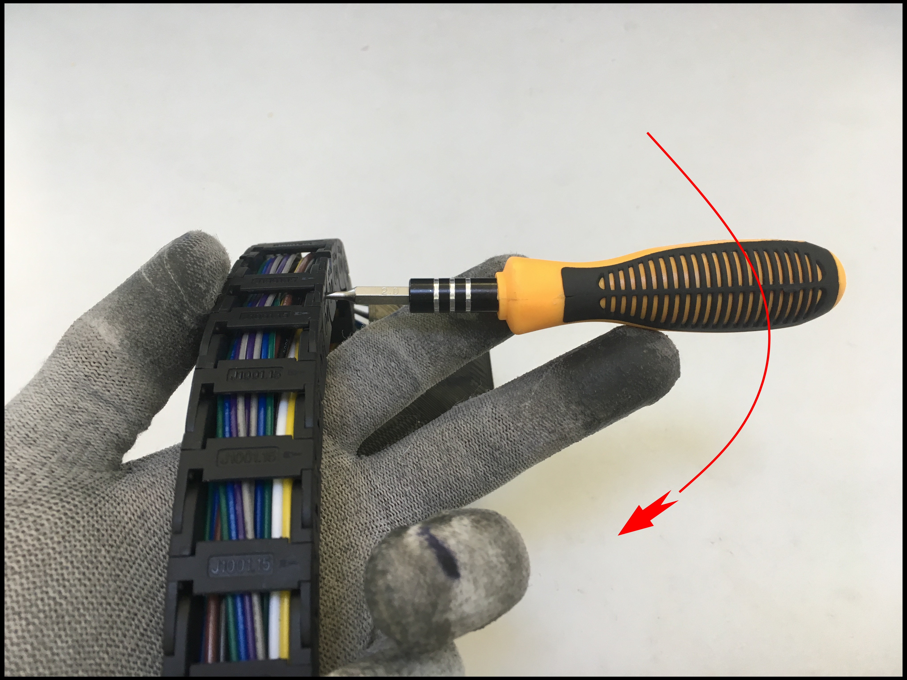

# Cable Chain

## What is the Cable Chain? 

This is the cable chain.

## Tools

* Small Flathead Screwdriver

## Additional Hardware 

_**None**_

## How To Open

Locate the clip on a cable chain. 

Look for a trapezoidal gap in the cable chain

Use a small flat-head screwdriver. Push in and then angle out. 

## How To Close

Press the links back to its original position. You will here a click, once its secured.

