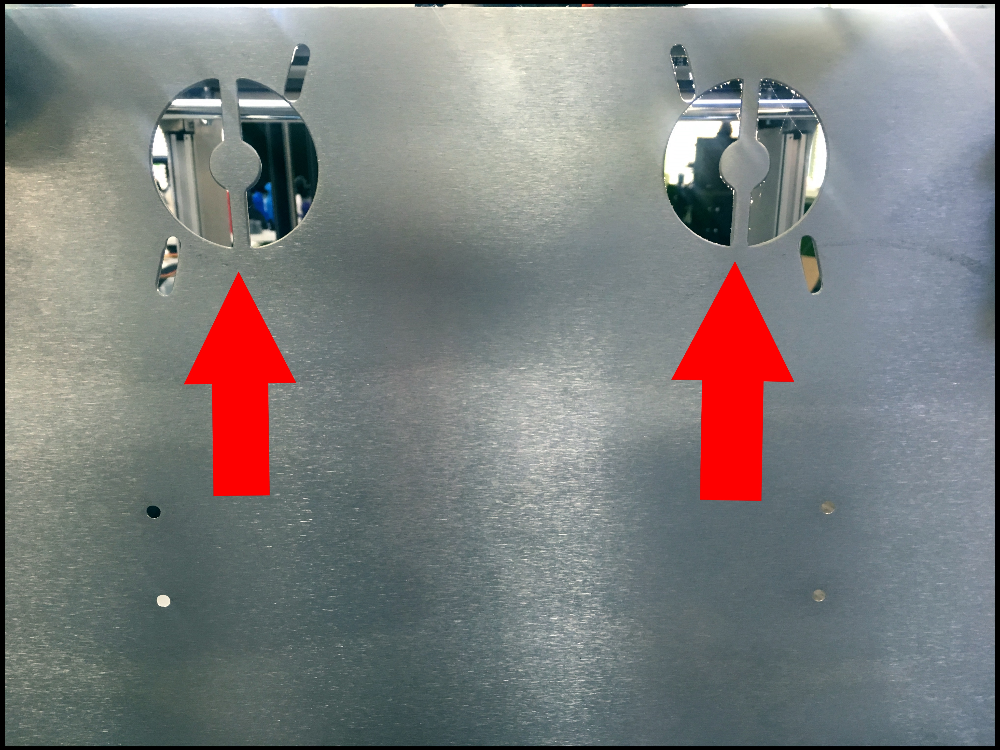
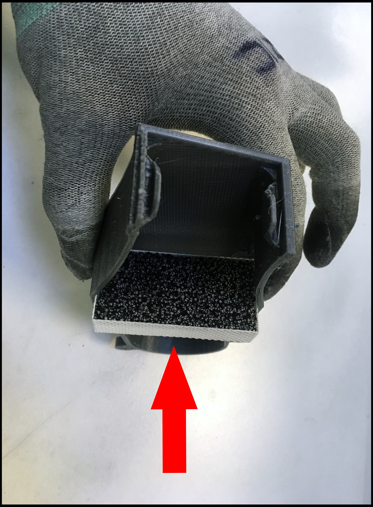
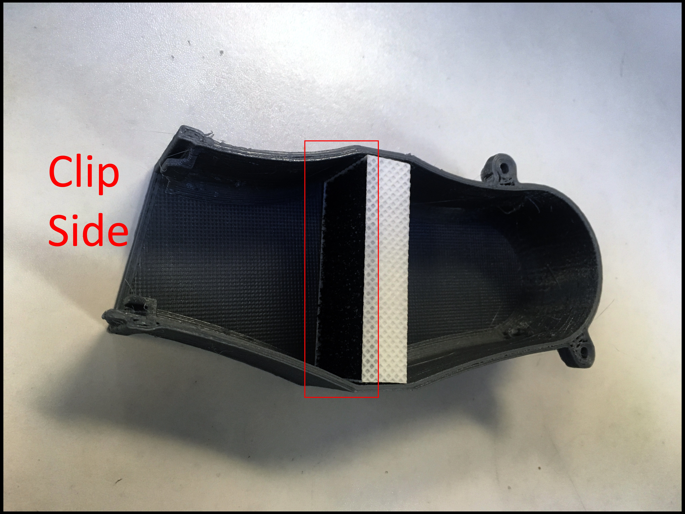
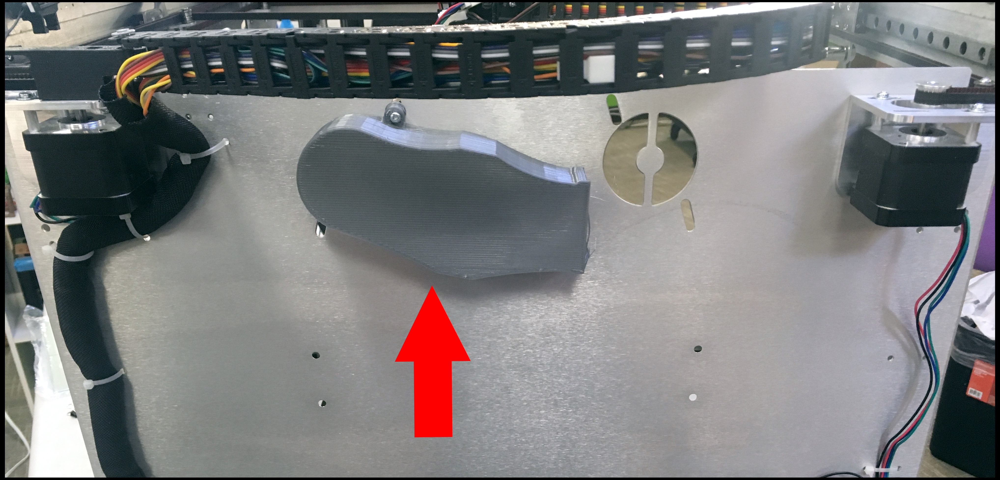
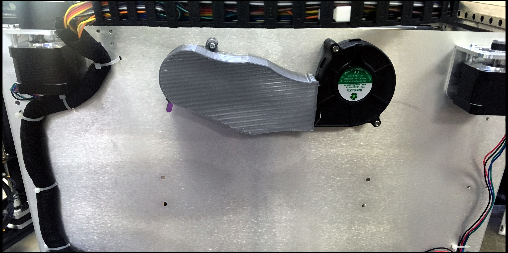
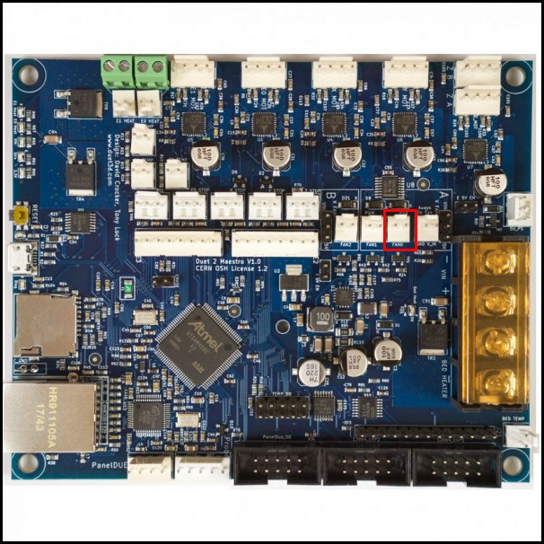
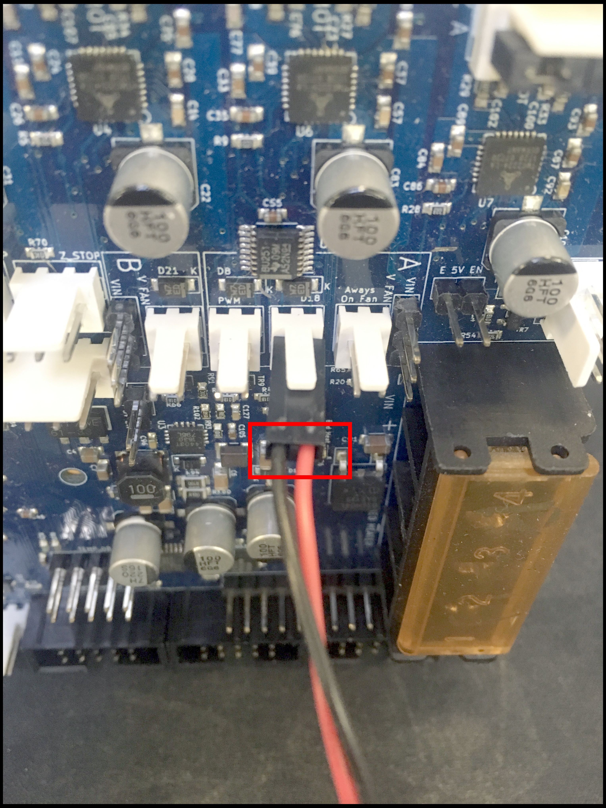
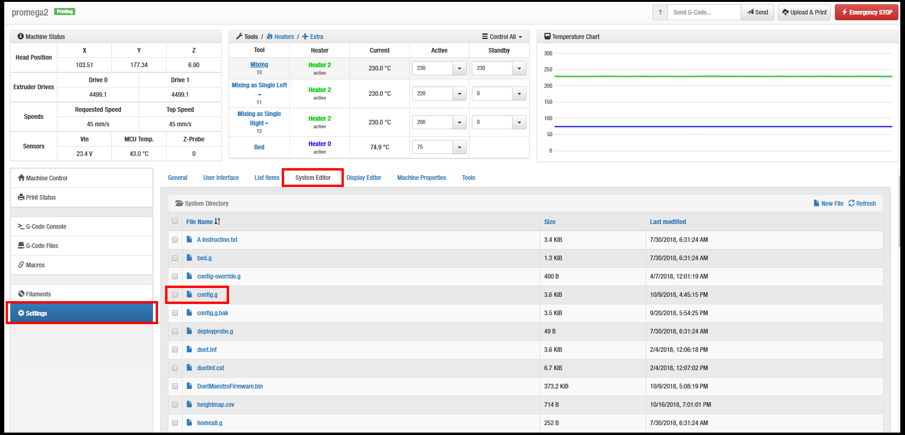

# Filtration System

## What is the Filtration System?


A blower fan pulls air from the printer's inside.

The pulled air is blown into a HEPA filter.

The filtered air is ejected into the printer's inside.

## How To Install

Look at the two holes used for the filtration system. Face the backside of your printer.



Slide the HEPA filter into the printed duct.



Make sure the carbon layer \(black\) is facing the clip side.



Install the printed part onto the left hole \(as shown below\). Use the short screws \(M3 x 12 mm\).


Install loosely.




Clip the blower fan into the duct.


Make sure you the label is pointing outward \(as shown below\).



Install the blower fan onto the right hole \(as shown below\).


Install loosely.




Check to see the blower fan is clipped into the duct.

Tighten all screws down.

Plug the blower fan cable into :

**FAN0**



_**Make Sure**_ the blower fan's **BLACK** wire \(ground\) is installed on the **LEFT** pin.




The blower fan will be damaged if installed backward. 


### Additional Software Changes

Open your web control browser

Go to the _**Settings**_ tab.

Click the _**System Editor**_ tab.

Look for the _**config.g**_ file. Open it \(double click\).



Look for the FANS header.

```text
; --- SECTION: FANS ( ) ---
```

Search for this specific code.

```text
M106 P0 S0 I0 F4 H-1 L0.3
```

Change S0 to S1.

```text
M106 P0 S1 I0 F4 H-1 L0.3
```

Click "Save Changes."

Done.

## How To Uninstall

Under Construction.

