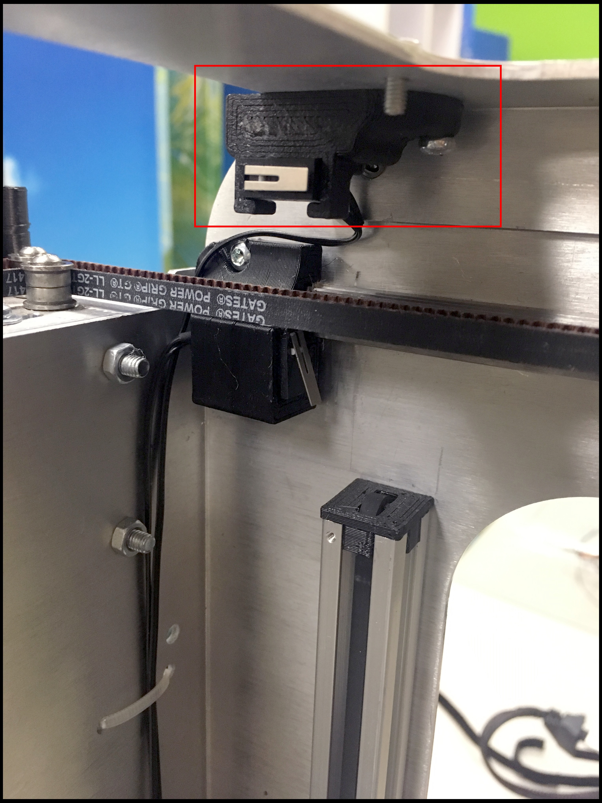
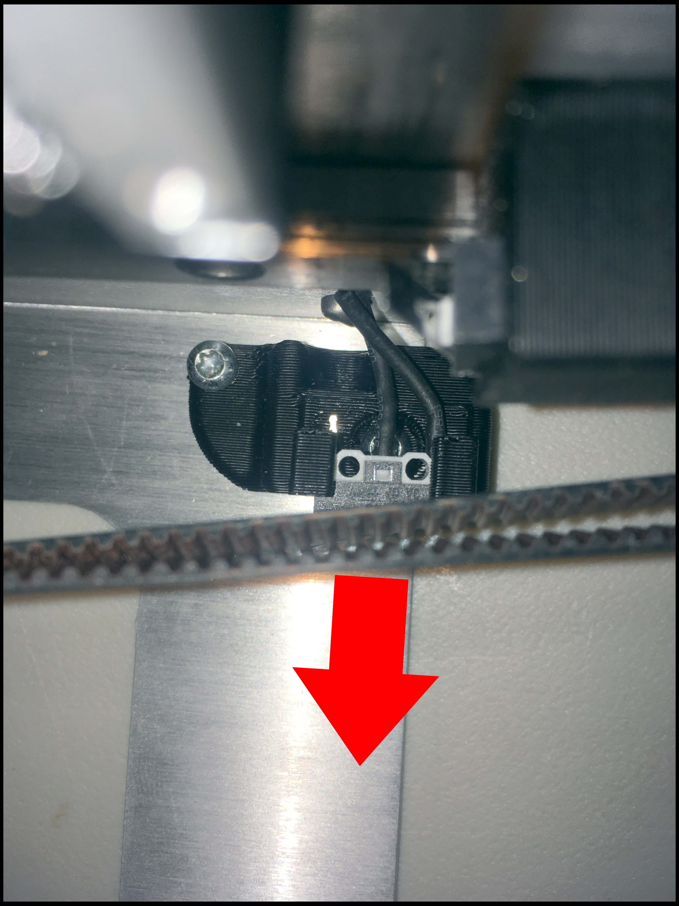
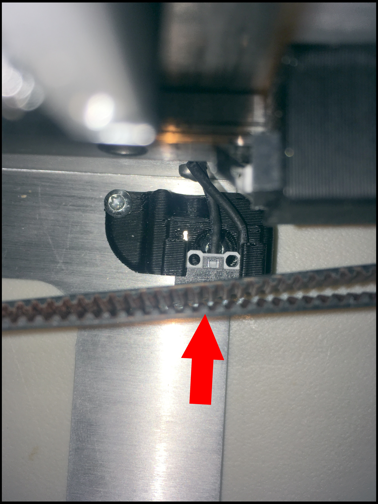

# X Axis

## What is the X Limit Switch Holder?

This is the X Limit Switch Holder.



## Warning

Exercise caution if you attempt to fit your head underneath the bed. The frame could potentially cause lacerations.  

* Use protective headgear \(e.g. tear-resistant fabric\).
* Enter slowly. Do not rush. 
* Make sure the bed is properly positioned.

## Tools

* T10 Screwdriver

## Additional Hardware

* _**None**_

## How To Uninstall

Run:

```text
M18 Z
```

This disables the Z motor. Lower the bed until it touches the Z limit switch.


Remove the Limit Switch from the holder:



Unscrew the X Limit Switch Holder \(printed part\):


## How To Install

Screw down the X Limit Switch:


Slide the Limit Switch into the X Limit Switch Holder \(printed part\):



Done.

