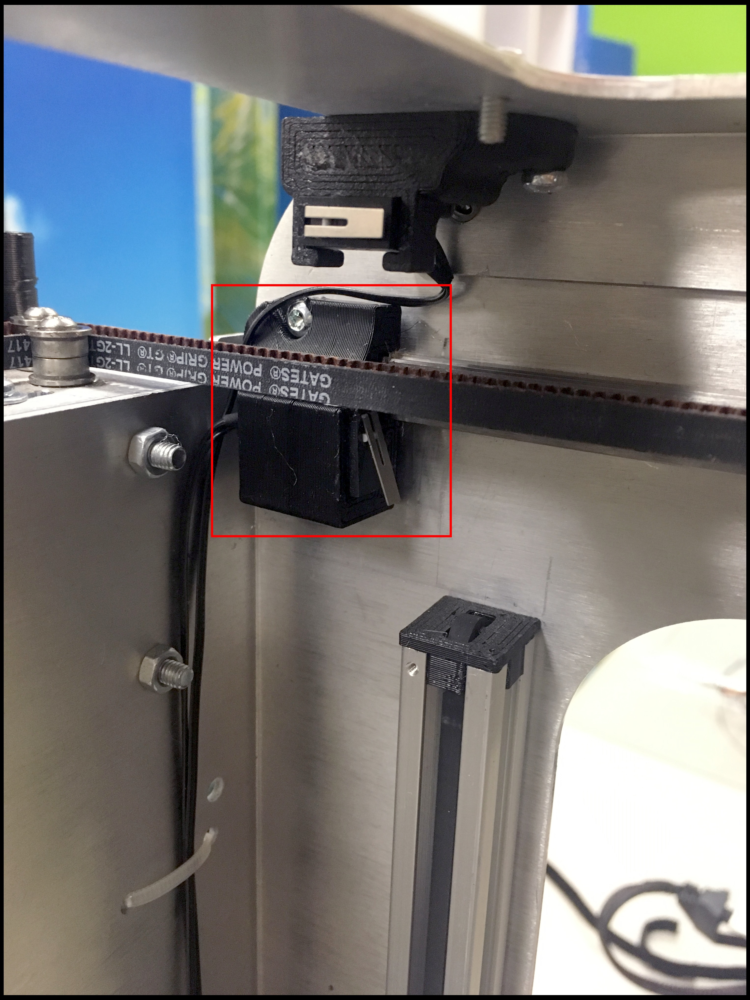
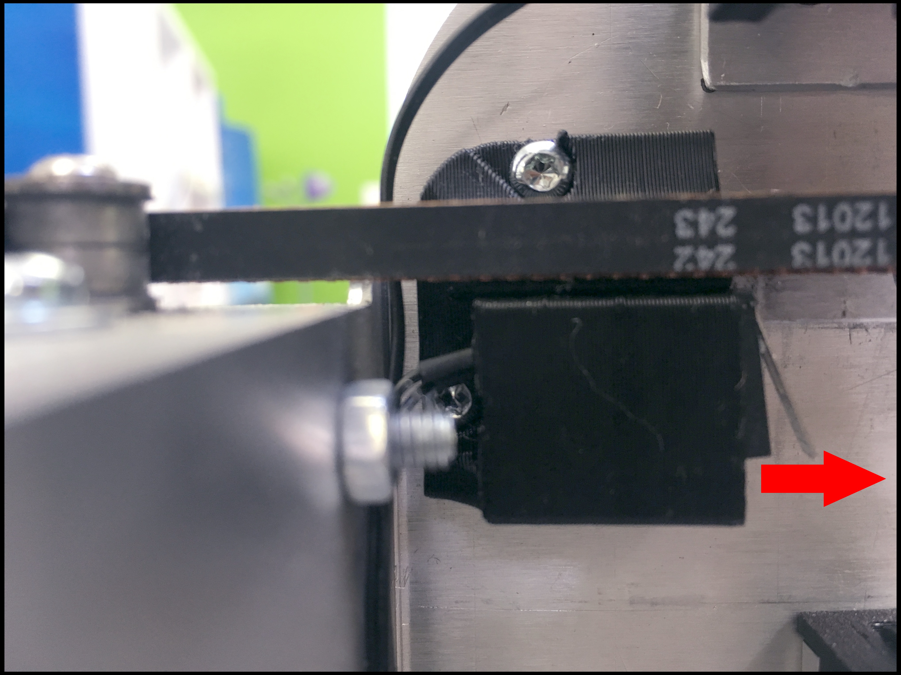
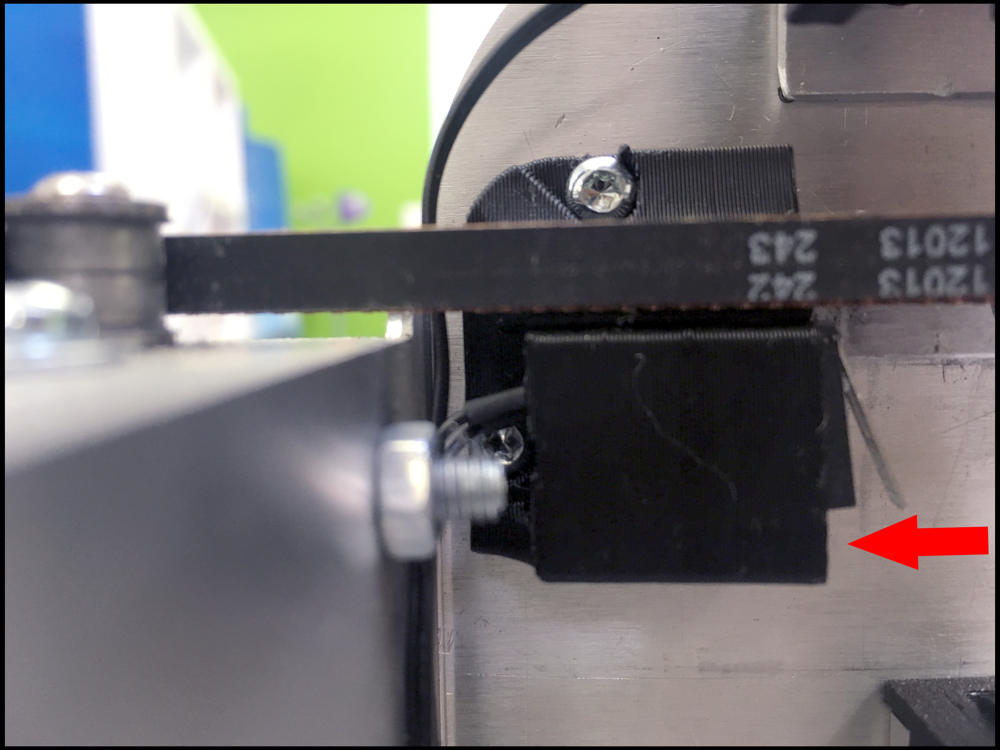

# Y Axis

## What is the Y Limit Switch Holder?

This is the Y Limit Switch Holder.



## Warning

Exercise caution if you attempt to fit your head underneath the bed. The frame could potentially cause lacerations.  

* Use protective headgear \(e.g. tear-resistant fabric\).
* Enter slowly. Do not rush. 
* Make sure the bed is properly positioned.

## Tools

* T10 Screwdriver

## Additional Hardware

* _**None**_

## How To Uninstall

Run:

```text
M18 Z
```

This disables the Z motor. Lower the bed until it touches the Z limit switch.


Unscrew the Y Limit Switch Holder \(printed part\):


Remove the Limit Switch from the holder:



## How To Install

Slide the Limit Switch into the Y Limit Switch Holder \(printed part\):



Screw down the Y Limit Switch:


Done.

