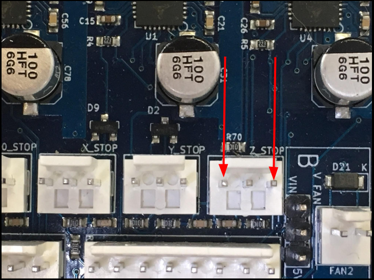
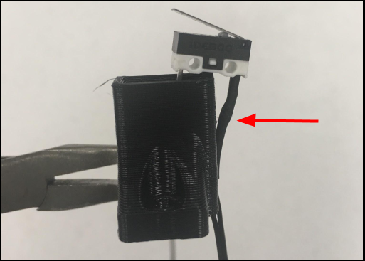
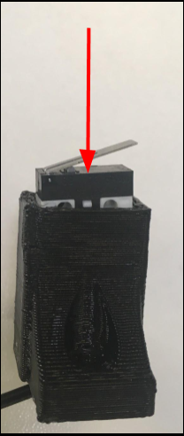
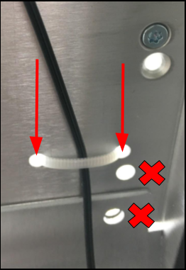
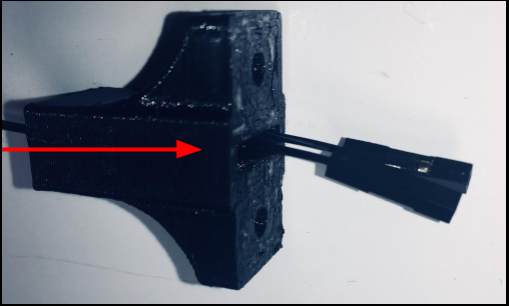
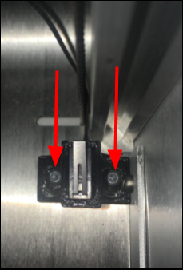

# Z Axis

## Warning

Exercise caution if you attempt to fit your head underneath the bed. The frame could potentially cause lacerations.  

* Use protective headgear \(e.g. tear-resistant fabric\).
* Enter slowly. Do not rush. 
* Make sure the bed is properly restrained.

## Tools

* T10 Screwdriver
* Flush Cutter \(or any cutting pliers will do\)

## Additional Hardware

* Nylon Zip tie \(1x\)

## How to Remove

### All Versions

Unscrew previous Z Limit Switch Housing.

Remove \(Clip\) Zip Tie.

Remove Limit Switch from previous casing.

* Suggestion: Use a long screwdriver to push the end-stop out of its casing \(e.g. Philips head, flat head\).
* Video Demonstration: ??

Disconnect Z Limit Switch from Duet Board

* Refer to " \[ Duet Wiring Guide Name\] " for additional help.

## How To Install

### Notes

A zip tie must secure the Z Limit Switch wire. If not, it runs the risk of entangling \(and potentially breaking\) with a moving bed.

### Version: 051162\_B1

Fit the Limit Switch Wire through the side slit on the Z Limit Switch Housing.

Firmly press/slide the Limit Switch into Z Limit Switch Housing.

* Make sure to press it in fully in, until a hard stop is reached.

Route Limit Switch Wire through side slot.

Screw down the Z Limit Switch Housing.

* Face the lever toward the rails.
* Remember to check for Limit Switching Wire.
  * It must route through the shorter side slot.
  * Do not let the wire compress between the Housing & the Sheet Metal.

Connect Limit Switch Wire to the Duet Board.

* Refer to “ \[ Duet Wiring Guide Name \]” for additional help.

Install Zip Tie.

* Using the previous holes.

* Refer to “ \[ Zip Tie Hole Guide Name \] “ for additional help.

### Version: 051162\_B2

Fit the Limit Switch Wire through the bottom slit on the Z Limit Switch Housing.

Firmly press/slide the Limit Switch into Z Limit Switch Housing.

* Make sure to press it in fully in, until a hard stop is reached.

Route Limit Switch Wire through side slot.

Screw down the Z Limit Switch Housing.

* Face the lever toward the rails.
* Remember to check for Limit Switching Wire.
  * It must route through the side slot.
  * Do not let the wire compress between the Housing & the Sheet Metal.

Connect Limit Switch Wire to the Duet Board.

* Refer to “ \[ Duet Wiring Guide Name \]” for additional help.

Install Zip Tie.

* Using the previous holes.

* Refer to “ \[ Zip Tie Hole Guide Name \] “ for additional help.

