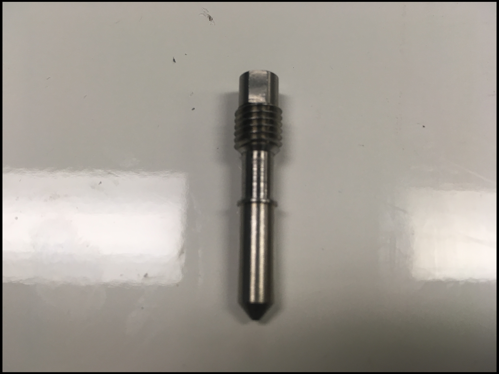
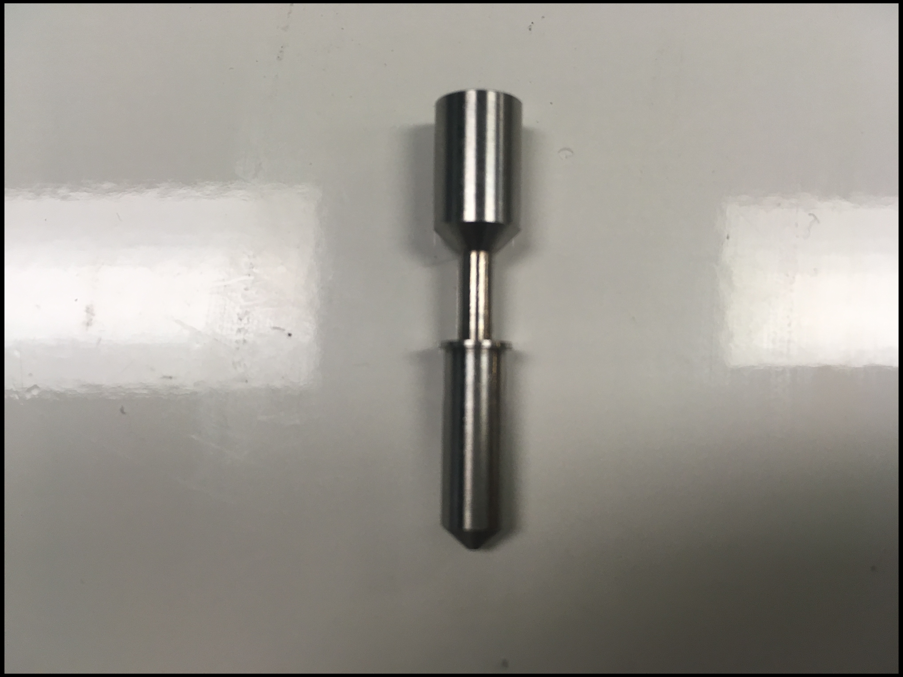
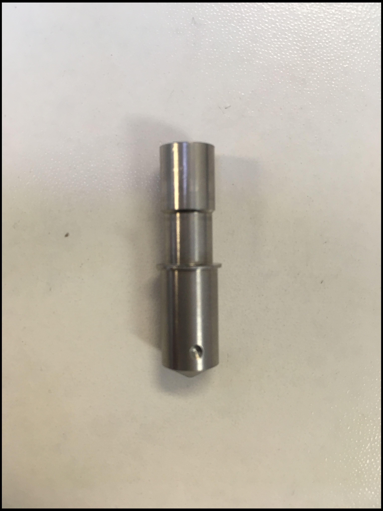
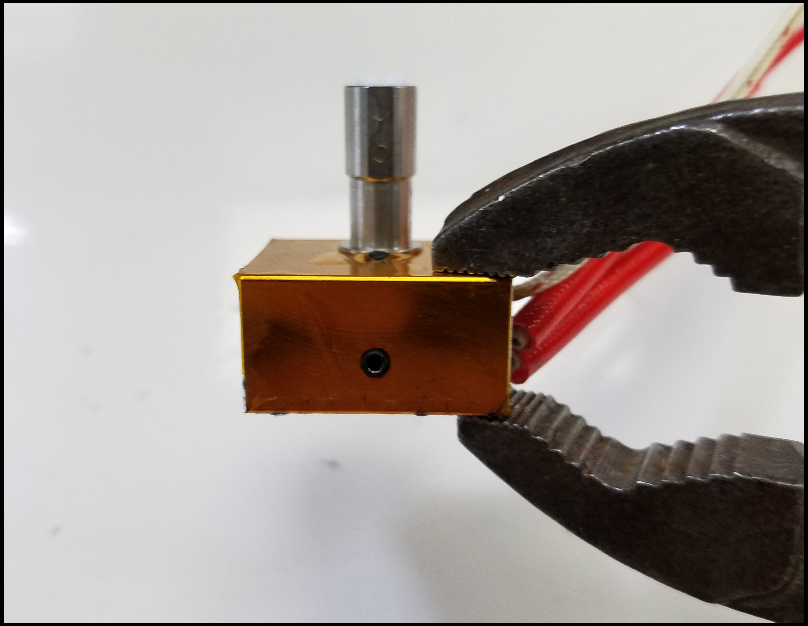
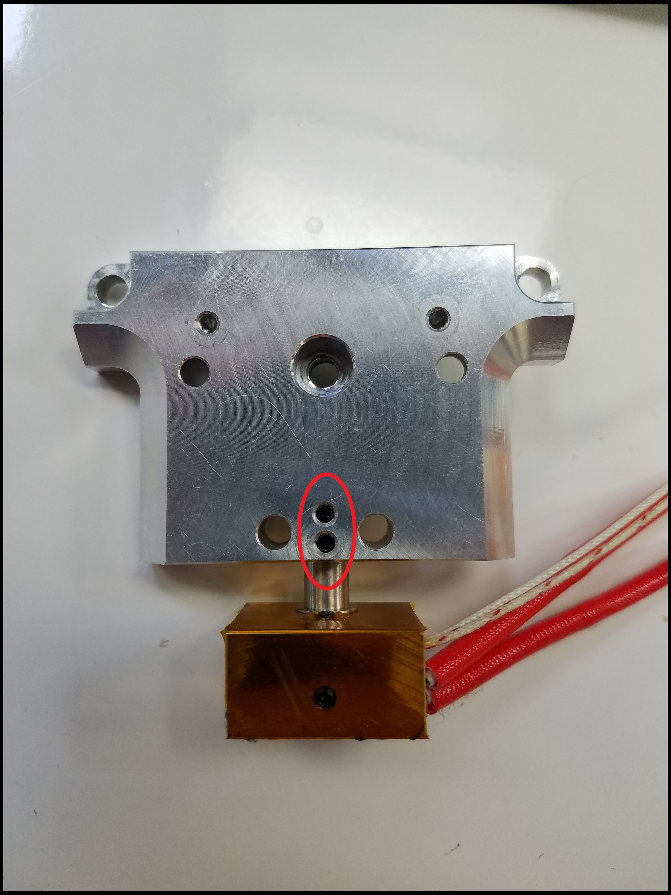
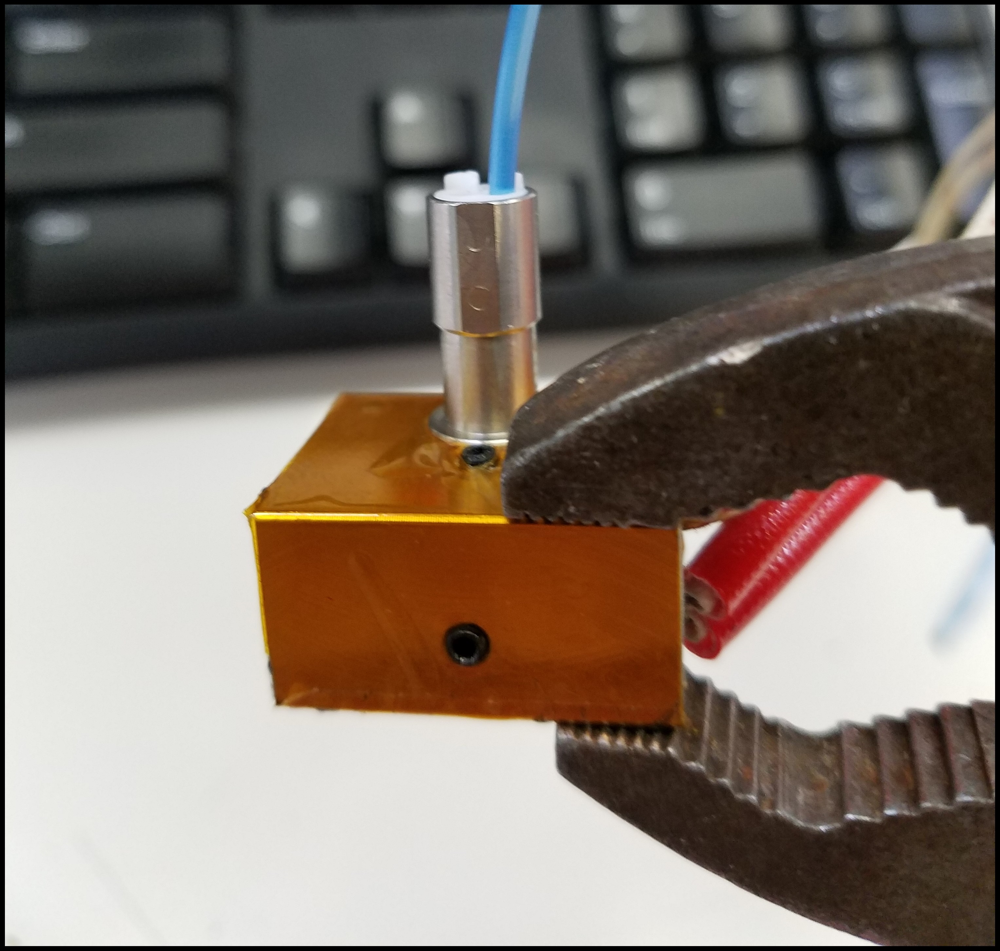
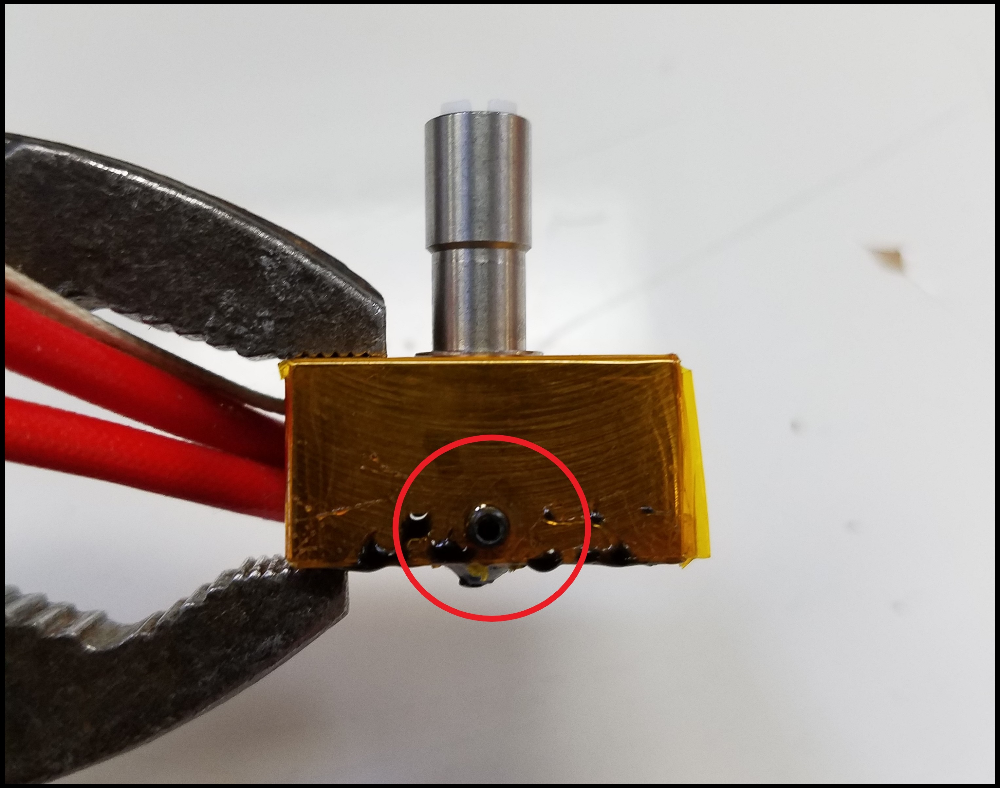

# Nozzle

## What is the Nozzle?

There are four types of nozzles.

### Single K'Tana

### High Temperature \(HT\) Single K'Tana 

### Compound Mixing

### High Temperature \(HT\) Compound Mixing


For each nozzle type, there are differing nozzle sizes \(e.g. 1 mm, 0.5 mm, 0.35 mm\)


## Warning

Follow the steps listed in the guide _**closely**_. You will be working with heated hot-ends. Use appropriate tools.

## Tools

* Metal Pliers \(Recommendation: Slip-joint pliers\)
* 1.5mm Hex Screwdriver
* 1.3mm Hex Screwdriver
* Heat-resistant surface

## Additional Hardware

* Mixing Compound PTFE Tube \(possibly, if current is not reusable\)
* Single K'tana PTFE Tube \(possibly, if current is not reusable\)

## How To Uninstall 

### Notes

Some of the following steps have to be performed with a heated hot-end in order to allow you to slide out and replace the nozzle. 


If you don't heat your nozzle cooled filament will act like glue and hold the components together.


Unplug the 24V cold-section fan on the front of the extruder.

Remove the cold-section fan. Follow: [Nozzle Fan Uninstall Guide](nozzle-fan.md#nozzle-fan) for help.

Connect to the Duet Web Console.

Heat-up the nozzle and retract any filament inside.


**Keep the nozzle hot for the next steps!** 


**Hold the heater block with pliers as shown in the images below.**

Remove the 1.5mm hex set-screws holding the compound heater block in place.

Slide the heater block and cold-section out of the extruder with the pliers.


\(Optional\) If you need to remove the PTFE tube from the extruder you can feed a bit of filament into the hot-end. 


This will push the PTFE tube up and out, allowing you to pull the PTFE tube out. Place this PTFE tube in the replacement nozzle.

Remove the screw indicated in the image below, this holds the nozzle inside the heater block.

 

With another pair of pliers, carefully pull out the nozzle from the heater block.

Place the **hot** nozzle on a heat-resistant surface. If you have a glass bed, you can place the nozzle on there.

## How To Install

### Notes

The following steps are a continuation from the "How To Uninstall" section of this page. 

With the pliers, grab the new nozzle and place it into the heater block, pay attention to the orientation of the nozzle. The dimple should face the set-screw in the heater block. This keeps the heater block in place during operation.

Tighten down the setscrew that holds the nozzle in place.

Place the nozzle, with the heater block attached, back into the extruder.

Tighten down the 1.5mm setscrews

**You can now power off the heater.**

You can attach the cold-section fan again and continue printing!

