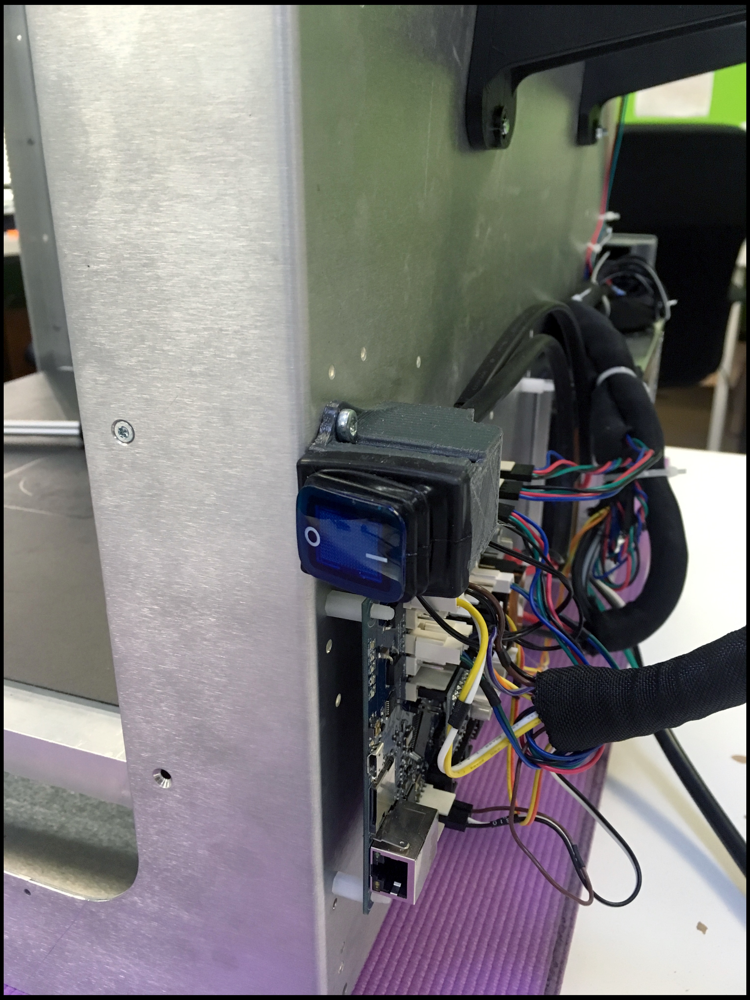

# Quad Add-On

## What is the Quad Add-On?

## Tools

* M3 Screwdriver
* M4 Screwdriver
* Super Glue
* Small Flat-Head Screwdriver

## Additional Hardware

_**NONE**_

## How To Install

#### Turn off Power

#### Unplug Power Supply

#### Remove Wall-E

\(Unfasten Cover\)



\(Remove Wall-E\)



#### Remove Cable Chain



#### Unfasten Gantry Belt Clamp



#### Remove X Axis System



#### Remove Extruder



#### Prep Promega-Quad Adapter



#### Install Promega-Quad Adapter



\[Make sure sliding well\]

#### Prep Cable Chain



#### Prep Duet Maestro



\[double check wiring\]

#### Install X Axis System



Install belts

\[loosen XY motors\]

\[re-loop belts\]

\[tighten XY motors\]

Install Quad

\[small prep as well\]

Install cable chain

Connect Quad

#### Plug-in Power Supply

### Additional Software Changes

Go to [GitHub](https://github.com/PrintM3D/Promega)

Download the Promega Source File.

Delete ALL content in SD Card.

Go to .../Downloads/promega-devel/Promega-devel/SD Card Structure/Quad.

Copy ALL and paste into SD Card.

Ready For Printing.

