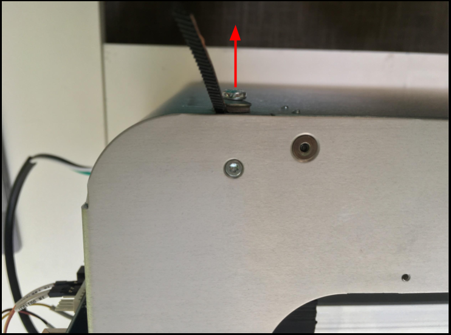
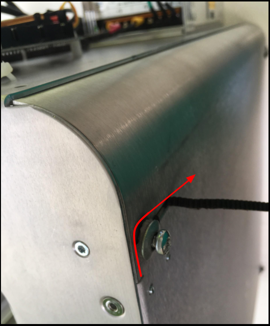
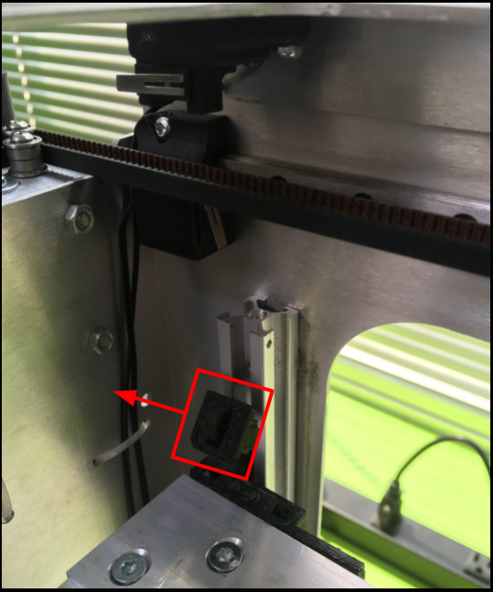
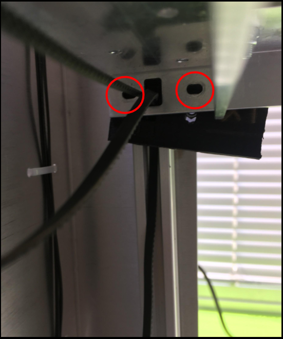
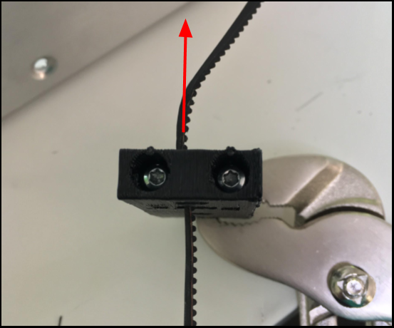

# Sliders

## What are the Sliders?

This is a Slider.

## Warning

Exercise caution if you attempt to fit your head underneath the bed. The frame could potentially cause lacerations.  

* Use protective headgear \(e.g. tear-resistant fabric\).
* Enter slowly. Do not rush. 
* Make sure the bed is properly restrained.

## Tools

* T10 Screwdriver
* T25 Screwdriver

## Additional Hardware

_**NONE**_

## How to Uninstall

### Notes:

Remove/Replace ONLY 1 slider at a time. You will find yourself scrambling to keep the bed aligned and in position if more than 1 slider, at any time, is removed.

### All versions

Place bed ~ 3/4s up the length of the rails.

Restrain the Z motor \(closed loop\) belt using a small binder clip, or any clamp.

Pick a side.

Loose the bottom M5 torx screw.

* Do not remove the screw.
* Loosen enough to remove the belt.

Loosen the bottom portion of the belt

Loosen all 3 M3 torx screws on the frame

* Removing them would be preferred, for easier installation

Remove the top z belt clamp.

Remove belt from the top z belt clamp.

Locate M3 screws from the slider.

Remove M3 screws from slider.

Pull sliders down.

Remove belts from the sliders.

## How To Install

### Notes:

If you are performing more than one slider replacement, you may find it beneficial to keep the corresponding rails loose until the very end \(tightening them as the last step of the _entire_ procedure\). 

* Definition of "Loose" : Partially unscrewed or Completely unscrewed.

### Version: Standard

#### Install Slider



#### Tighten Belt



#### Tighten Slider



