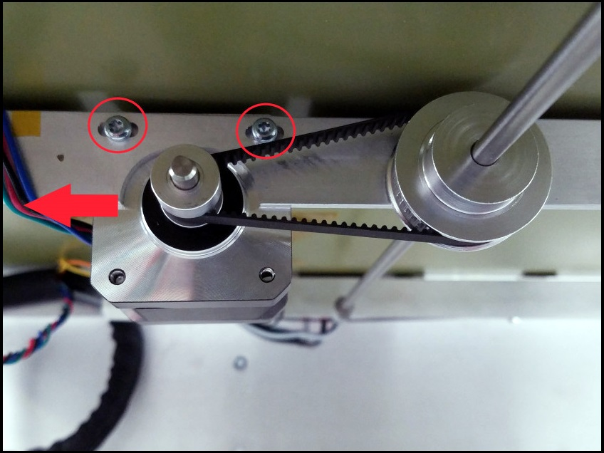

# Slowing Down Your Bed

If you bed crashes against the nozzle or another part of the extruder it will cause the Z-axis motor to skip. The motor skips to prevent damage to a glass bed or the Z-platform itself. This skip can also cause your bed to misalign, if this occurs, follow the [Mechanical Leveling](mechanical-bed-leveling.md) guide to fix this issue.

Once the Z-motor skips it will power off and will not hold the position of the bed. Due to the weight of the bed and the lack of friction the bed can fall with speed. This can be dangerous, therefore it is best to **keep clear of the Promega while it is moving.** The speed of the fall of the bed can be reduced greatly by:

* Properly tensioning the Z-assembly belts according to the [Belt Tensioning](belt-tensioning.md#corexy-tuning) guide.

In addition, tighten the Z-motor belt by loosening the two screws on the bottom of the Z-platform and pulling the motor as shown in the image below.

Tighten the Z-motor belt pulley against the rail in order to increase friction.

