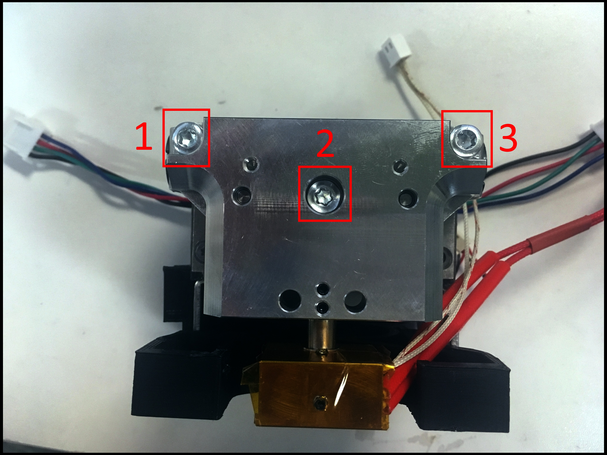
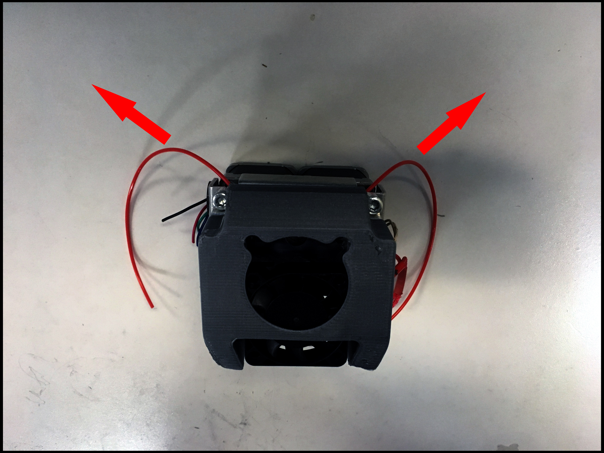

# Unclogging The Nozzle

Slide your Cold Section Fan half-way down.

Unscrew the M3 screws on your Wall-E.

Remove the Wall-E


Be cautious. Parts housed in the Wall-E may fall out. Do Not lose them.


Carefully bend the filament out of the filament path.


Avoid doing this with PLA or any other brittle filament.


Heat the nozzle to 200 C.

Wait for the temperature to reach.

Retract the filament out.

Turn off the nozzle

Wait for the nozzle to cool.

Re-install any missing components in the Wall-E.


Double check all components are installed. Failure to do so will prevent the printer from working.  
  
Check using this [Single K'Tana](../documentation/mechanical-systems/single-ktana.md#back-components) or [Compound Mixing](../documentation/mechanical-systems/compound-mixing.md#back-components) parts guide. 


Install the Wall-E back into the chassis.

Use the M3 screws to tighten the Wall-E.


Lightly tighten the M3 screws. Do Not Over-tighten.


Slide you Cold Section Fan back to original position. 

Done.

